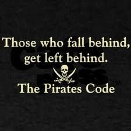

# Module 0: Crypto is Here - Why Financial Professionals Need to Understand Cryptocurrency and Why Crypto Needs Smart Finanical Professionals
## Table of Contents

- [Introduction](#introduction)
- [Beyond the Memes: A Real Industry](#beyond-the-memes-a-real-industry)
- [The Inevitable Reality: Crypto is Here to Stay](#the-inevitable-reality-crypto-is-here-to-stay)
- [Your Professional Responsibility](#your-professional-responsibility)
- [Why Crypto Needs You](#why-crypto-needs-you)
- [The Financial Ecosystem Opportunity](#the-financial-ecosystem-opportunity)
- [Preventing the Next Financial Crisis](#preventing-the-next-financial-crisis)
- [Envisioning the Future](#envisioning-the-future)
- [Conclusion](#conclusion)

## Introduction

Let me be direct with you: cryptocurrency is not going away. Whether you're a CFO, financial analyst, CPA, or financial advisor, you're going to encounter cryptocurrency in your professional life sooner rather than later. Your clients are already asking about it, your competitors are starting to offer crypto services, and the financial landscape is shifting beneath your feet.

This isn't about jumping on a bandwagon or chasing the latest trend. This is about professional survival and growth in a rapidly evolving financial ecosystem. The cryptocurrency industry has matured from its early days of Bitcoin enthusiasts and experimental projects into a legitimate, multi-trillion-dollar financial sector that's attracting serious institutional players and regulatory attention.

## Beyond the Memes: A Real Industry

> **Note:** I know what you're thinking: "Isn't cryptocurrency just memecoins and speculative trading?" Yes and... 

The reality is that while memecoins and speculative trading exist (and often dominate the headlines), they represent only a small portion of the actual cryptocurrency industry.

The cryptocurrency ecosystem includes:
- **Established cryptocurrencies** like Bitcoin and Ethereum that serve as digital stores of value, investment assets, and platforms for decentralized applications
- **Enterprise blockchain solutions** being developed by major corporations for supply chain management, digital identity, and financial services
- **Central Bank Digital Currencies (CBDCs)** being developed by governments around the world
- **Decentralized finance protocols** that recreate traditional financial services without intermediaries
- **Smart contract platforms** that automate complex financial transactions and agreements

Yes, there are inexperienced participants, meme-driven projects, and speculative bubbles. But there are also serious technologists, established financial institutions, and legitimate use cases that are transforming industries. The challenge is separating the signal from the noise, a skill that you, as a seasoned financial professional, already excel at.

## The Inevitable Reality: Crypto is Here to Stay

> **Note:** Cryptocurrency is currently at over $2 trillion in market capitalization as of August 2025. 

Major corporations like Tesla, MicroStrategy, and Square have added Bitcoin to their corporate treasuries. Traditional financial institutions are offering cryptocurrency custody services. Payment processors like PayPal and Square have integrated crypto payments. Even central banks are developing their own digital currencies. (We'll talk about the pro and cons of this later.)

The VC firm [a16z](https://a16z.com/) alone has over $46 billion in assets under management, with approximately $7.6 billion (about 16.5%) dedicated specifically to crypto and Web3 investments.

This isn't speculative hype—it's institutional adoption on a massive scale. The question isn't whether cryptocurrency will become mainstream; it's when, and whether you'll be prepared to serve your clients when that happens.

Consider this: cryptocurrency represents the natural evolution of money, just as we evolved from salt and copper coins to paper money, checks, credit cards, and digital payments. The technology has matured, the regulatory frameworks are developing, and the market infrastructure is in place. The ship has left port, and you need to decide whether you're on board or walking the plank.

 

## Your Professional Responsibility

As a financial professional, you have a responsibility to your clients that extends beyond just managing their current needs. You need to prepare them for the future, and that future increasingly includes cryptocurrency. Whether it's a client who has inherited cryptocurrency and needs help understanding the tax implications, a business owner considering accepting Bitcoin payments, or an investor looking to diversify their portfolio, you need to be able to provide informed, professional guidance.

Your clients trust you to be their financial compass, guiding them through complex decisions and helping them navigate new opportunities. If you can't speak intelligently about cryptocurrency, you're not just failing to provide value, you're potentially putting your clients at risk by leaving them to seek advice from less qualified sources.

> **Note:** Remember: your clients are already learning about cryptocurrency from social media, news outlets, and their social networks. Wouldn't you rather they learn from you, a qualified financial professional who understands both traditional finance and the emerging crypto landscape?

## Why Crypto Needs You

Here's something that might surprise you: the cryptocurrency industry desperately needs people like you. While the technology is impressive and the potential is enormous, the industry is largely run by software developers, entrepreneurs, and investors who often lack the deep understanding of financial markets, risk management, and regulatory compliance that you bring to the table.

The crypto space is the high school cafeteria of sterotypes. There are the jocks playing with memecoins, the nerdy devs building sophiscated software but can't speak about, the class president raising VC funding, the theater kids building non-profits and DAOs for at-risk youths, and there's you...the math club, debate team members with near-perfect SAT scores. The world needs all kinds of kinds. 

Crypto needs you: 

1. **You understand market manipulation** in ways that most crypto participants don't. You've seen how traditional financial markets can be gamed, how bubbles form and burst, and how regulatory oversight can prevent or mitigate financial crises. The cryptocurrency market needs this perspective to mature into a stable, trustworthy financial system.

1. **You have technical reasoning skills** for risk assessment and investment analysis that are sorely lacking in the crypto space. While many crypto projects have innovative technology, they often lack proper financial modeling, risk assessment frameworks, and due diligence processes. Your expertise in evaluating financial opportunities and identifying potential risks is invaluable.

1. **You understand regulatory compliance** and the importance of following established financial rules and procedures. The cryptocurrency industry is still developing its regulatory framework, and your knowledge of traditional financial regulations can help shape a more compliant, sustainable crypto ecosystem.

> [!Note] My grandma needs you to advise her against the nice man on the phone who promises 10,000% returns on her retirement savings with "memecoins". She needs to be attending brunch with bottomless mimosas and stuffing her stashed-away singles in the G-string of the sexy bartenders, not worrying about crypto market volatility.

## The Financial Ecosystem Opportunity

The cryptocurrency industry isn't just about Bitcoin anymore. It's a complex ecosystem that includes many coins and blockchains, decentralized finance (DeFi) protocols, non-fungible tokens (NFTs), smart contracts, and entirely new financial instruments that don't exist in traditional finance.

This ecosystem is attracting massive amounts of capital. Venture capital firms have invested billions of dollars in cryptocurrency and blockchain startups. Institutional investors are allocating portions of their portfolios to cryptocurrency assets. Traditional financial institutions are developing cryptocurrency products and services.

For financial professionals, this represents an unprecedented opportunity to expand your service offerings and attract new clients. You can become the go-to expert for cryptocurrency tax planning, help businesses integrate crypto payments, provide investment advice for crypto portfolios, or offer compliance consulting for crypto businesses.

The beauty of this opportunity is that it builds on your existing expertise while opening new doors. You're not starting from scratch, you're applying your financial knowledge to a new asset class and technology platform.

## Preventing the Next Financial Crisis

This is where your expertise becomes crucial. The cryptocurrency industry is still in its adolescence, and like any young financial system, it's vulnerable to the same types of problems that have plagued traditional finance: fraud, market manipulation, excessive speculation, and regulatory gaps.

We've seen this movie before. The 2008 financial crisis was caused by complex financial instruments that few people understood, inadequate risk management, and regulatory oversight that failed to keep pace with innovation. The cryptocurrency industry is at risk of repeating these mistakes on a potentially larger scale.

Financial professionals who understand both traditional finance and cryptocurrency are uniquely positioned to help prevent these problems. You can:
- Develop risk assessment frameworks for cryptocurrency investments
- Create compliance procedures for crypto businesses
- Educate clients about the risks and opportunities in the crypto space
- Advocate for sensible regulation that protects investors while fostering innovation
- Help integrate cryptocurrency into traditional financial systems in a responsible way
- Advise grandma on good uses of her hard-earned bills

This isn't just about protecting your clients, it's about protecting the entire financial system from the next crisis.

## Envisioning the Future

Let's dream a little. What could a world with widespread cryptocurrency adoption look like? 

To every steampunk, dystopian future there is the [solarpunk](https://en.wikipedia.org/wiki/Solarpunk) option for a brighter future. 

Imagine a financial system where:
- Cross-border payments are instant and nearly free
- Financial services are accessible to anyone with an internet connection
- Smart contracts automatically execute complex financial agreements, with visible and auditable code
- Digital identity systems eliminate fraud and streamline compliance
- Decentralized finance provides [Confidentiality, Integrity, and Availability](https://www.fortinet.com/resources/cyberglossary/cia-triad) of banking services (no more "too-big-to-fail" dependencies)
- Marginalized communities have equal access to banking services
- Targeted populations under authoritarian regimes are protected from discriminatory de-banking, or denial of banking services
- Freedom of Speech and the Right to Transact is preserved through privacy technologies

This isn't science fiction; it's the direction the industry is moving. The question is whether this future will be built responsibly, with proper risk management and regulatory oversight, or whether it will develop chaotically, leading to the same problems that have plagued traditional finance.

Financial professionals have a unique opportunity to shape this future. By bringing your expertise in risk management, compliance, and financial analysis to the cryptocurrency space, you can help ensure that this new financial system is built on solid foundations rather than speculative hype.

## Case Study: **GiveDirectly's Crypto Aid in Kenya**

In 2020, the nonprofit organization [GiveDirectly](https://www.givedirectly.org/) partnered with [GiveCrypto](https://givecrypto.org/) to provide direct cryptocurrency assistance to vulnerable populations in Kenya during the COVID-19 pandemic. The initiative distributed cryptocurrency to over 1,000 households in rural Kenya who had no access to traditional banking services.

**The Challenge:**
- Rural Kenyans faced severe economic hardship during COVID-19 lockdowns
- Traditional banking infrastructure was inaccessible in remote areas
- Mobile money services like M-Pesa had high transaction fees
- Many families couldn't afford basic necessities or medical care

**The Solution:**
GiveDirectly distributed cryptocurrency (Bitcoin) directly to recipients' mobile wallets, allowing them to:
- Convert crypto to local currency through local exchanges
- Access funds without traditional bank accounts
- Avoid high fees from mobile money services
- Receive aid quickly without bureaucratic delays (crypto: ~10minutes, banking: +2-3 business days)

**Results:**
- 1,000+ households received direct cryptocurrency assistance
- Recipients reported improved food security and access to healthcare
- Lower transaction costs compared to traditional aid distribution
- Faster delivery of funds during emergency situations

**Why This Matters for Financial Professionals:**
This case demonstrates how cryptocurrency can serve as a financial inclusion tool, providing banking services to populations that traditional financial institutions cannot or will not serve. Understanding these applications helps financial professionals evaluate the broader social and economic impact of cryptocurrency beyond speculative trading.

[Source: GiveDirectly's 2020 Annual Report](https://www.givedirectly.org/annual-reports/) and [GiveCrypto's Impact Report](https://givecrypto.org/impact/)

## Conclusion

Cryptocurrency represents the most significant financial innovation since the creation of electronic banking. It's not going away, and it's not just a passing fad. It's a fundamental shift in how we think about money, value, and financial transactions.

As a financial professional, you have a choice: you can either embrace this change and position yourself as a leader in the new financial landscape, or you can ignore it and risk being left behind as your clients and competitors move forward.

This course isn't about making you a cryptocurrency expert overnight. It's about giving you the foundational knowledge you need to understand what's happening in the crypto space, evaluate opportunities and risks, and provide informed guidance to your clients.

The cryptocurrency industry needs people like you—people who understand finance, risk, and regulation. Your expertise is valuable, and the industry is willing to pay for it. But first, you need to understand the basics.

So let's get started. In the following modules, we'll explore the fundamentals of cryptocurrency and blockchain technology, examine different types of cryptocurrencies and their uses, analyze the risks and opportunities, and discuss practical applications for financial professionals.

The future of finance is being written right now. The question is whether you'll be a part of writing it or just reading about it later.

> [!Note] Are you ready to take your place among crypto-savvy financial professionals, shedding light on a complex industry? Join our learning cohorts. [TODO: Insert links to buy our course, or book in-person.]

