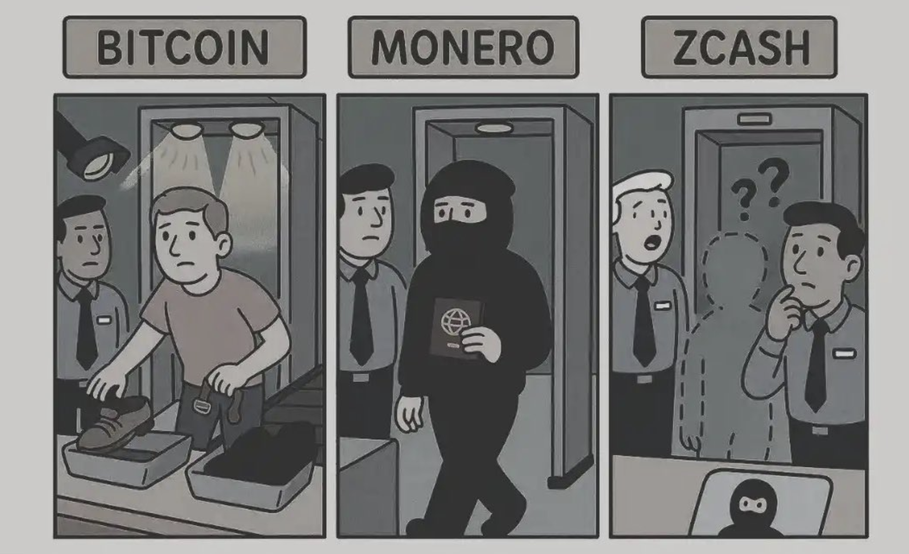

# Module 3: Cryptocurrency Types and Major Players

## Table of Contents

- [Introduction](#introduction)
- [(Layer 0) vs Layer 1 vs Layer 2](#layer-0-vs-layer-1-vs-layer-2)
- [Layers vs Tokens vs Coins](#layers-vs-tokens-vs-coins)
- [Bitcoin: The Digital Gold](#bitcoin-the-digital-gold)
- [Altcoins: The Alternative Cryptocurrencies](#altcoins-the-alternative-cryptocurrencies)
- [Stablecoins: Bridging Traditional and Digital Finance](#stablecoins-bridging-traditional-and-digital-finance)
- [Utility Tokens vs Security Tokens](#utility-tokens-vs-security-tokens)
- [Governance Tokens and DAOs](#governance-tokens-and-daos)
- [Privacy Coins: Anonymity in the Digital Age](#privacy-coins-anonymity-in-the-digital-age)
- [Layer 2 Solutions for Scaling](#layer-2-solutions-for-scaling)
- [Memecoins](#memecoins)
- [NFTs: Non-Fungible Tokens](#nfts-non-fungible-tokens)
- [Tokenomics: Understanding Cryptocurrency Economics](#tokenomics-understanding-cryptocurrency-economics)
- [Supporting Players](#supporting-players)
- [Conclusion](#conclusion)

## Introduction

Now that we understand the foundational technology behind blockchain, it's time to explore the diverse ecosystem of the major palyers that have emerged over the past decade. The cryptocurrency landscape has evolved far beyond Bitcoin, with thousands of different digital assets and entities serving various purposes and use cases.

This module will provide a comprehensive overview of the major categories of cryptocurrencies, their unique characteristics, and the factors that influence their value and utility. We'll explore everything from Bitcoin's role as digital gold to the emerging world of decentralized governance tokens.

## (Layer 0) vs Layer 1 vs Layer 2

Before diving into specific cryptocurrency types, it's essential to understand the fundamental distinction between Layer 1 and Layer 2 solutions in the blockchain ecosystem.

**Layer 1 (L1) blockchains** are the foundational networks that provide the base infrastructure for cryptocurrency transactions. These are the primary blockchains like Bitcoin, Ethereum, and Solana that process and validate transactions directly on their main networks. Layer 1 solutions are responsible for:

- **Consensus mechanisms**: The rules that determine how transactions are validated and added to the blockchain
- **Security**: The cryptographic and economic incentives that protect the network from attacks
- **Data availability**: Ensuring all transaction data is publicly accessible and verifiable
- **Decentralization**: Maintaining a distributed network of validators or miners

Layer 1 blockchains face what's known as the "blockchain trilemma" - the challenge of achieving decentralization, security, and scalability simultaneously. Most L1 networks prioritize decentralization and security at the expense of scalability, which is why they often have limited transaction throughput and higher fees during periods of high demand.

**Layer 2 (L2) solutions** are protocols built on top of existing Layer 1 blockchains that aim to improve scalability and reduce transaction costs. These solutions process transactions off the main chain and then settle the results on the Layer 1 network. Layer 2 solutions provide:

- **Increased throughput**: The ability to process many more transactions per second than the base layer
- **Lower fees**: Reduced transaction costs by batching multiple transactions together
- **Faster finality**: Quicker transaction confirmation times
- **Enhanced user experience**: Better performance for applications and users

Common Layer 2 solutions include:
- **Bitcoin Lightning Network**: Enables instant, low-cost Bitcoin transactions through payment channels
- **Ethereum Rollups**: Solutions like Optimistic Rollups and ZK-Rollups that bundle transactions and submit them to Ethereum
- **Polygon**: A sidechain solution for Ethereum that provides faster and cheaper transactions
- **Arbitrum and Optimism**: Optimistic rollup solutions that scale Ethereum applications

The relationship between Layer 1 and Layer 2 is symbiotic - Layer 2 solutions enhance the utility of Layer 1 networks, while Layer 1 networks provide the security and decentralization that make Layer 2 solutions viable. This layered approach is likely to become increasingly important as cryptocurrency adoption grows and the need for scalable solutions becomes more pressing.

> [!Note] If you are talking to a Layer 2 company, and they can't tell you their Layer 1...run!

Wait you skipped over a **Layer 0**!

**Layer 0 (L0)** represents the foundational infrastructure layer that provides the basic building blocks for the entire blockchain ecosystem. Think of Layer 0 as the "internet of blockchains" - the underlying protocols, networks, and infrastructure that enable Layer 1 blockchains to communicate, share data, and interoperate.

**Key characteristics of Layer 0 solutions:**

- **Cross-chain interoperability**: Enabling different blockchains to communicate and share data
- **Infrastructure services**: Providing shared resources like oracles, data feeds, and identity systems
- **Network protocols**: Establishing standards for blockchain communication and consensus
- **Developer tools**: Creating foundational frameworks and SDKs for blockchain development
- **Security primitives**: Providing cryptographic and security infrastructure

**Examples of Layer 0 solutions:**

- **Polkadot (DOT)**: A Layer 0 protocol that enables multiple blockchains to interoperate through its relay chain and parachain architecture
- **Cosmos (ATOM)**: A Layer 0 ecosystem that provides the Inter-Blockchain Communication (IBC) protocol for cross-chain data transfer
- **Chainlink (LINK)**: A decentralized oracle network that provides real-world data to smart contracts across multiple blockchains
- **The Graph (GRT)**: A decentralized indexing protocol that enables efficient data querying across multiple blockchains
- **Helium (HNT)**: A decentralized wireless network infrastructure that provides connectivity for IoT devices
- **Filecoin (FIL)**: A decentralized storage network that provides data storage infrastructure for the entire blockchain ecosystem
- **Autonomy (AUTO)**: A Layer 0 protocol that provides decentralized storage infrastructure and cross-chain data services

The relationship between Layer 0, Layer 1, and Layer 2 creates a complete stack where Layer 0 provides the foundational infrastructure, Layer 1 provides the blockchain networks, and Layer 2 provides the scaling solutions. This layered approach enables the complex ecosystem of applications and services that make up the modern cryptocurrency landscape.

## Layers vs Tokens vs Coins

Let's take a look at the fundamental differences between blockchain layers, tokens, and coins. These terms are often used interchangeably, but they represent distinct concepts in the cryptocurrency ecosystem. 

### **Coins vs Tokens: The Foundation**

**Coins** are the native cryptocurrencies of their own blockchain networks. They serve as the primary means of value transfer and network security for their respective blockchains. Key characteristics of coins include:

- **Native to their blockchain**: Bitcoin (BTC) is the native coin of the Bitcoin blockchain
- **Network security**: Coins are used to pay for transaction fees and incentivize network participants
- **Consensus participation**: Coins are required for staking, mining, or other consensus mechanisms
- **Independent existence**: Coins don't rely on other blockchains for their operation

**Examples of coins:**
- **Bitcoin (BTC)**: Native coin of the Bitcoin blockchain
- **Ethereum (ETH)**: Native coin of the Ethereum blockchain
- **Solana (SOL)**: Native coin of the Solana blockchain
- **NEAR (NEAR)**: Native coin of the NEAR Protocol blockchain (AI focused)
- **Monero (XMR)**: Native privacy coin of the Monero blockchain
- **Zcash (ZEC)**: Native privacy coin of the Zcash blockchain
- **Midnight (MID)**: Native privacy coin of the Midnight blockchain by Shield Labs

**Tokens** are digital assets that exist on top of existing blockchain networks. They leverage the infrastructure and security of their underlying blockchain but serve specific purposes within applications or ecosystems. Key characteristics of tokens include:

- **Built on existing blockchains**: Tokens use the infrastructure of Layer 1 networks
- **Smart contract-based**: Most tokens are created using smart contracts (like ERC-20 on Ethereum)
- **Specific utility**: Tokens often have defined use cases within particular applications
- **Dependent on underlying blockchain**: Tokens inherit the security and consensus of their base layer

**Examples of tokens:**
- **Tether (USDT)**: A stablecoin token that exists on multiple blockchains
- **Uniswap (UNI)**: A governance token for the Uniswap protocol on Ethereum
- **Chainlink (LINK)**: A utility token for the Chainlink oracle network
- **Filecoin (FIL)**: A utility token for decentralized storage services

### **Regulatory Implications**

The classification of digital assets has important regulatory implications:

**Coins:**
- May be treated as commodities or currencies depending on jurisdiction
- Often have clearer regulatory frameworks than tokens
- May face different tax treatment than tokens

**Tokens:**
- May be classified as securities, utilities, or commodities
- Regulatory treatment often depends on the token's use case and structure
- May require different compliance procedures than coins

## Bitcoin: The Digital Gold

Bitcoin, the first and most well-known cryptocurrency. First, it has a fixed supply of 21 million coins, making it inherently deflationary. This scarcity is built into the protocol and cannot be changed without consensus from the entire network. Second, Bitcoin uses a Proof of Work consensus mechanism, which we explored in Module 2, making it extremely secure but energy-intensive.

The Bitcoin network processes approximately 7 transactions per second, which is significantly lower than traditional payment systems like Visa, which can handle thousands of transactions per second. This limitation has led to debates about Bitcoin's role as a medium of exchange versus a store of value. Recall, transcations are verfied in 10 minute increments. 

Bitcoin often serves as a benchmark for the entire cryptocurrency market; when Bitcoin's price moves, it typically influences the prices of other cryptocurrencies. Additionally, Bitcoin's fixed supply and deflationary nature make it an interesting case study in monetary economics.

Bitcoin's value proposition lies in its combination of scarcity, security, and decentralization. Unlike fiat currencies, which can be printed indefinitely by central banks, Bitcoin's supply is mathematically limited.

However, Bitcoin also faces significant challenges. Its energy consumption has raised environmental concerns, and its transaction speed and cost limitations make it less suitable for everyday payments. Additionally, Bitcoin's price volatility could make it a risky investment and a poor medium of exchange in the short term.

## Altcoins: The Alternative Cryptocurrencies

The term "altcoin" refers to any cryptocurrency other than Bitcoin. Since Bitcoin's creation, thousands of altcoins have been developed, each with its own unique characteristics and use cases.

**Ethereum** is perhaps the most significant altcoin, often referred to as the "world computer." Unlike Bitcoin, which was designed primarily as a payment system, Ethereum was created to be a platform for decentralized applications (dApps) and smart contracts. This makes Ethereum more than just a cryptocurrency, it's a complete ecosystem for building decentralized applications.

Ethereum's native cryptocurrency, Ether (ETH), serves multiple purposes. It's used to pay for transaction fees on the network, it's required to participate in the network's consensus mechanism, and it's used as collateral in various DeFi applications. This multi-faceted utility makes Ethereum's value proposition more complex than Bitcoin's.

Other major altcoins include Binance Coin (BNB), which powers the Binance exchange ecosystem, and Cardano (ADA), which aims to provide a more sustainable and scalable alternative to Ethereum. Unlike Bitcoin, which has a relatively simple value proposition, altcoins often derive their value from complex ecosystems and use cases.

## Stablecoins: Bridging Traditional and Digital Finance

Stablecoins represent one of the most important innovations in the cryptocurrency space, as they attempt to solve the volatility problem that has limited cryptocurrency adoption for everyday use. A stablecoin is a cryptocurrency that maintains a stable value relative to a specific asset, typically a fiat currency like the US dollar.

There are several types of stablecoins, each with different mechanisms for maintaining price stability. Fiat-collateralized stablecoins, like **Tether (USDT)** and **USD Coin (USDC)**, are backed by reserves of fiat currency held in bank accounts. These stablecoins maintain their peg by allowing holders to redeem them for the underlying fiat currency.

Crypto-collateralized stablecoins, like Dai, are backed by other cryptocurrencies but use complex mechanisms to maintain price stability. Dai, for example, is backed by Ethereum but uses a system of collateralization ratios and automated liquidation to maintain its dollar peg.

Algorithmic stablecoins attempt to maintain price stability through algorithmic mechanisms rather than collateral. These stablecoins use smart contracts to automatically adjust supply based on market conditions, but they have proven to be less reliable than collateralized stablecoins.

Stablecoins provide a bridge between traditional finance and the cryptocurrency ecosystem, and serve as a stable store of value within the volatile cryptocurrency ecosystem.

> [!Note] You may say, is Tether an L1 or L2? Neither! It's a token traded on an L1 like Ethereum or Bitcoin.

## Utility Tokens vs Security Tokens

Understanding the distinction between utility tokens and security tokens is crucial for financial professionals, as it has significant implications for regulation, taxation, and investment analysis.

Utility tokens are cryptocurrencies that provide access to a specific product or service within a blockchain ecosystem. They're not designed as investments but rather as a means of accessing functionality. For example, Filecoin tokens are used to pay for decentralized storage services, while Basic Attention Token (BAT) is used within the Brave browser ecosystem to reward content creators and advertisers.

Security tokens, on the other hand, represent ownership of an underlying asset, such as equity in a company, real estate, or other traditional securities. These tokens are subject to securities regulations and must comply with the same rules as traditional securities.

The distinction between utility tokens and security tokens is not always clear, and regulatory guidance has evolved over time. The Howey Test, developed by the US Supreme Court, is often used to determine whether a token qualifies as a security. If a token involves an investment of money in a common enterprise with the expectation of profit from the efforts of others, it may be classified as a security.

For financial professionals, this distinction is important for several reasons. Security tokens are subject to strict regulatory requirements, including registration with regulatory authorities and compliance with anti-money laundering and know-your-customer regulations. Utility tokens may have fewer regulatory requirements but may also offer less investor protection.

The regulatory landscape for tokens is still evolving, and financial professionals need to stay current with developments in this area. The classification of a token can have significant implications for how it can be traded, who can invest in it, and what disclosures are required.

## Governance Tokens and DAOs

Governance tokens represent one of the most innovative applications of blockchain technology, enabling decentralized decision-making in organizations known as Decentralized Autonomous Organizations (DAOs). These tokens give holders the right to participate in governance decisions, such as protocol upgrades, treasury management, and strategic direction.

DAOs are organizations that operate according to rules encoded in smart contracts, with decisions made through token holder voting rather than traditional hierarchical management. This represents a fundamental shift in how organizations can be structured and governed.

The governance token model has been adopted by many DeFi protocols, including Uniswap, Compound, and Aave. Token holders can propose changes to the protocol, vote on proposals, and participate in the governance of the ecosystem. This creates a more democratic and transparent form of organizational governance.

However, DAOs also face significant challenges. Voter apathy is common, with many token holders choosing not to participate in governance decisions. Additionally, the concentration of tokens among a small number of holders can lead to centralization of power, undermining the democratic ideals of DAOs.

For financial professionals, understanding governance tokens and DAOs is important because they represent a new model of organizational governance that may become more prevalent in the future. Additionally, governance tokens can have significant value, as they provide control over valuable protocols and ecosystems.

The valuation of governance tokens is complex, as it involves both the economic value of the underlying protocol and the governance rights that the tokens confer. Financial professionals need to understand both aspects to properly evaluate these investments.

## Privacy Coins: Anonymity in the Digital Age

Privacy coins are cryptocurrencies designed to provide enhanced privacy and anonymity for users. While Bitcoin transactions are pseudonymous (linked to addresses rather than real identities), they are still traceable on the public blockchain. Would you expose your bank statements and the value of all your investment accounts to the world? Or keep that between you and Fidelity. Privacy coins use various cryptographic techniques to obscure transaction details and provide true anonymity: you, and only you, know your account balance. You and only sex worker Chanelita know what you did last weekend, not Uncle Sam nor Chase Bank or Venmo. (We don't judge. 😉)  



- **Monero (XMR)** is perhaps the most well-known privacy coin, using ring signatures and stealth addresses to hide transaction details.
- **Zcash (ZEC)** uses zero-knowledge proofs to make transactions provably and mathematically private. 

These technologies make it extremely difficult (or impossible) to trace transactions or identify users.

> It would be unprofessional of me, to not mention the reputation that Monero has for the go-to currency for drug dealers and black market trading. 

Privacy coins raise important questions about the balance between privacy and regulatory compliance. While privacy is a fundamental human right, privacy coins can also be used for illicit activities, including money laundering and tax evasion.

> Some might even go to far as to say the banning of privacy coins, is a ban on the right to transact privately, a ban on freedom of speech (money is speech), and ultimately an infingement on human rights.

For financial professionals, privacy coins present both opportunities and challenges. On the one hand, they may appeal to clients who value privacy and are concerned about surveillance. On the other hand, they may face regulatory restrictions and reputational risks.

Just as there are times when you want to speak publicly on Twitter, there are also times to speak privately on Signal's encrypted communcations. There are times for public ledgers for auditing of governement spending and non-profits and there are times for personal privacy. 

## Layer 2 Solutions for Scaling

The Lightning Network is a Layer 2 solution for Bitcoin that enables instant, low-cost transactions by creating payment channels between users. Instead of broadcasting every transaction to the Bitcoin network, users can make multiple transactions through a payment channel, with only the opening and closing transactions recorded on the main blockchain.

These Layer 2 solutions are crucial for the long-term viability of cryptocurrency networks, as they enable the networks to handle the transaction volume needed for widespread adoption.  Networks with effective scaling solutions may be more likely to achieve widespread adoption and maintain their value over time. However, they also add complexity to the ecosystem and may introduce new security considerations.

## Memecoins
Memecoins represent one of the most unique and controversial categories in the cryptocurrency ecosystem. These are cryptocurrencies that are created primarily for entertainment, community building, or as internet culture phenomena, often with little to no underlying utility or technological innovation.

Memecoins are cryptocurrencies that derive their value primarily from social media hype, community engagement, and viral marketing rather than technological innovation or real-world utility. They often feature catchy names, internet memes, or pop culture references that resonate with online communities.

Notable examples of memecoins:
- **Dogecoin (DOGE)**: Originally created as a joke based on the "Doge" meme, it became one of the most recognizable cryptocurrencies
- **Shiba Inu (SHIB)**: Inspired by Dogecoin, created as a "Dogecoin killer" with a large token supply
- **Pepe (PEPE)**: Based on the popular "Pepe the Frog" meme, gained significant attention in 2023
- **Floki Inu (FLOKI)**: Named after Elon Musk's dog, capitalizing on the Dogecoin phenomenon

Memecoins can experience massive price increases in short periods, but they can also lose value just as quickly. Many memecoins have limited liquidity, making it difficult to buy or sell large amounts without significantly affecting the price. Traditional investment analysis methods are often irrelevant for memecoins, as their value is driven by sentiment rather than fundamentals. Success in memecoin investing often depends on entering and exiting at the right time, which is extremely difficult to predict.

> **Coins vs Tokens** But if they are called meme-coins, they have a native blockchain? Yes and no. Some meme-coins should in fact be called meme-tokens, for example PEPE is built on ETH as it's Layer 1. But DOGE is a native coin on it's own blockchain.

## NFTs: Non-Fungible Tokens

Non-Fungible Tokens (NFTs) enable the digital ownership and trading of unique digital assets. Unlike cryptocurrencies, which are fungible (interchangeable), NFTs are unique and cannot be replaced by another identical token.

**Fungible:** A US dollar bill. All are the same.
**Non-Fungible:** A signed, rookie year, Babe Ruth baseball card. Unique. 

**What Makes NFTs Unique:**

- **Non-fungibility**: Each NFT has unique characteristics that distinguish it from all other tokens
- **Digital scarcity**: NFTs can represent ownership of digital items that are truly scarce
- **Programmable ownership**: Smart contracts can encode complex ownership rights and royalty structures
- **Interoperability**: NFTs can be used across different applications and platforms
- **Verifiable authenticity**: Blockchain provides proof of ownership and authenticity

**Types of NFTs:**

- **Digital Art**: Original digital artwork, illustrations, and creative pieces
- **Collectibles**: Digital trading cards, virtual pets, and rare items
- **Virtual Real Estate**: Land and property in virtual worlds and metaverses
- **Music and Audio**: Songs, podcasts, and audio recordings with embedded rights
- **Video Content**: Short clips, movies, and video art
- **Gaming Assets**: In-game items, characters, and virtual goods
- **Identity and Credentials**: Digital identity documents, certifications, and memberships
- **Real Estate**: Tokenized ownership of physical real estate properties

**Notable NFT Projects:**

- **CryptoPunks**: One of the first NFT collections, featuring 10,000 unique pixelated characters
- **Bored Ape Yacht Club (BAYC)**: Exclusive collection of 10,000 unique ape NFTs with membership benefits
- **Decentraland**: Virtual real estate NFTs in a decentralized virtual world

**Financial Implications for Professionals:**

NFTs present unique challenges and opportunities for financial professionals:

- **Valuation complexity**: Traditional valuation methods may not apply to digital assets
- **Tax considerations**: NFT transactions may trigger capital gains, income, or gift tax implications
- **Liquidity concerns**: Many NFTs have limited trading volume and may be difficult to sell quickly
- **Storage and security**: Digital assets require secure storage and protection from theft
- **Regulatory uncertainty**: The regulatory status of NFTs is still evolving in many jurisdictions

**Use Cases Beyond Speculation:**

While NFTs are often associated with digital art speculation, they have practical applications:

- **Supply chain tracking**: NFTs can represent ownership of physical goods with embedded tracking
- **Intellectual property**: NFTs can encode licensing rights and royalty structures
- **Event ticketing**: NFTs can serve as verifiable tickets with embedded benefits
- **Real estate**: Fractional ownership of properties through tokenization
- **Identity verification**: Secure, verifiable digital identity documents

> NFTs are not just expensive JPEGs. They represent a fundamental shift in how we think about digital ownership, authenticity, and value.Understanding NFTs means understanding the future of digital asset management.

## Tokenomics: Understanding Cryptocurrency Economics

Tokenomics refers to the economic model of a cryptocurrency, including its supply, distribution, and incentive mechanisms. Understanding tokenomics is crucial for evaluating cryptocurrency investments, as it provides insight into the long-term value proposition of a token.

Key aspects of tokenomics include the total supply of tokens, the rate at which new tokens are created (inflation), and how tokens are distributed among different stakeholders. Some cryptocurrencies have fixed supplies like Bitcoin, while others have inflationary models designed to incentivize network participation.

The distribution of tokens is also important, as concentrated ownership can lead to centralization and manipulation. Many cryptocurrencies allocate a portion of tokens to developers, early investors, and community members, with the goal of creating a more decentralized and sustainable ecosystem.

Incentive mechanisms are another crucial aspect of tokenomics. Many cryptocurrencies use token rewards to incentivize network participation, such as mining rewards in Bitcoin or staking rewards in Proof of Stake networks. These incentives must be carefully designed to ensure long-term sustainability.

## Supporting Players

The cryptocurrency ecosystem extends far beyond just the digital assets themselves. A complex network of supporting companies and services has emerged to facilitate, regulate, analyze, and support the broader crypto industry. Understanding these supporting players is crucial for financial professionals as they represent both business opportunities and potential risks for clients.

### **Custody and Wallet Services**

**Custodial Services:**
- **[Coinbase Custody](https://custody.coinbase.com)**: Institutional-grade custody for large investors
- **[Fidelity Digital Assets](https://digitalassets.fidelity.com)**: Traditional financial institution entering crypto custody
- **[Anchorage Digital](https://anchorage.com)**: Specialized in institutional custody solutions
- **[BitGo](https://bitgo.com)**: Multi-signature wallet and custody services

**Non-Custodial Solutions:**
- **[MetaMask](https://metamask.io)**: Popular browser-based wallet for Ethereum
- **[Ledger](https://ledger.com)**: Hardware wallet manufacturer for cold storage
- **[Trezor](https://trezor.io)**: Another major hardware wallet provider
- **[Trust Wallet](https://trustwallet.com)**: Mobile wallet owned by Binance

### **Data and Analytics Providers**

**Market Data:**
- **[CoinGecko](https://coingecko.com)**: Comprehensive cryptocurrency data and rankings
- **[CoinMarketCap](https://coinmarketcap.com)**: Market cap and price data aggregator
- **[Messari](https://messari.io)**: Research and analytics platform for crypto assets
- **[Glassnode](https://glassnode.com)**: On-chain analytics and market intelligence

**Blockchain Analytics:**
- **[Chainalysis](https://chainalysis.com)**: Blockchain analysis for compliance and investigation
- **[Elliptic](https://elliptic.co)**: Risk management and compliance for crypto businesses
- **[CipherTrace](https://ciphertrace.com)**: Blockchain intelligence and anti-money laundering
- **[TRM Labs](https://trmlabs.com)**: Digital asset compliance and risk management

### **Legal and Compliance Services**

**Law Firms:**
- **[Perkins Coie](https://perkinscoie.com)**: Leading crypto law practice
- **[Hogan Lovells](https://hoganlovells.com)**: International law firm with crypto expertise
- **[Katten](https://katten.com)**: Financial services law with crypto focus
- **[Fenwick & West](https://fenwick.com)**: Technology law firm serving crypto companies

**Compliance Services:**
- **[Chainalysis](https://chainalysis.com)**: Regulatory compliance and investigation tools
- **[Elliptic](https://elliptic.co)**: Anti-money laundering and compliance solutions
- **[ComplyAdvantage](https://complyadvantage.com)**: Real-time financial crime detection
- **[Shyft Network](https://shyft.to)**: Identity verification and compliance infrastructure

### **Accounting and Tax Services**

**Accounting Firms:**
- **[Deloitte](https://deloitte.com)**: Big Four firm with blockchain and crypto practice
- **[PwC](https://pwc.com)**: Comprehensive crypto accounting and advisory services
- **[KPMG](https://kpmg.com)**: Digital asset services and blockchain consulting
- **[EY](https://ey.com)**: Blockchain assurance and crypto tax services

**Tax Software:**
- **[CoinTracker](https://cointracker.io)**: Cryptocurrency tax calculation and reporting
- **[TaxBit](https://taxbit.com)**: Automated crypto tax compliance
- **[CryptoTrader.Tax](https://cryptotrader.tax)**: Tax loss harvesting and reporting
- **[ZenLedger](https://zenledger.io)**: Tax software for crypto investors

### **Infrastructure and Development**

**Cloud and Infrastructure:**
- **[Alchemy](https://alchemy.com)**: Blockchain infrastructure and development platform
- **[Infura](https://infura.io)**: Ethereum infrastructure and API services
- **[QuickNode](https://quicknode.com)**: Blockchain infrastructure and node services
- **[Vultr](https://vultr.com)**: Cloud infrastructure and hosting services
- **[Akash](https://akash.network)**: Decentralized cloud computing platform
- **[NEAR Intents](https://intents.near.org)**: Cross-chain user intent execution infrastructure

**Development Tools:**
- **[OpenZeppelin](https://openzeppelin.com)**: Smart contract development and security
- **[Truffle](https://trufflesuite.com)**: Ethereum development framework
- **[Hardhat](https://hardhat.org)**: Ethereum development environment
- **[Remix](https://remix.ethereum.org)**: Browser-based Solidity IDE

### **Insurance and Risk Management**

**Crypto Insurance:**
- **[Coincover](https://coincover.com)**: Cryptocurrency insurance and recovery services
- **[Evertas](https://evertas.com)**: Insurance for crypto assets and mining operations
- **[Breach Insurance](https://breachinsurance.com)**: Cyber insurance for crypto companies
- **[Lloyd's of London](https://lloyds.com)**: Traditional insurer entering crypto space

**Risk Management:**
- **[Chainalysis](https://chainalysis.com)**: Risk assessment and compliance tools
- **[Elliptic](https://elliptic.co)**: Transaction monitoring and risk scoring
- **[CipherTrace](https://ciphertrace.com)**: Blockchain forensics and risk analysis
- **[TRM Labs](https://trmlabs.com)**: Digital asset risk management

### **Media and Information**

**News and Media:**
- **[CoinDesk](https://coindesk.com)**: Leading crypto news and information platform
- **[Decrypt](https://decrypt.co)**: Crypto news and educational content
- **[Cointelegraph](https://cointelegraph.com)**: International crypto news platform
- **[The Rollup](https://therollup.co)**: Crypto news and analysis platform

**Research and Analysis:**
- **[Messari](https://messari.io)**: Crypto research and analytics
- **[Delphi Digital](https://delphidigital.io)**: Institutional-grade crypto research
- **[The Block Research](https://theblock.co/research)**: Market analysis and insights
- **[Glassnode](https://glassnode.com)**: On-chain analytics and market intelligence

The supporting players ecosystem continues to evolve rapidly, with traditional financial services companies increasingly entering the space and new specialized services emerging to meet the unique needs of the cryptocurrency industry. Financial professionals who understand this ecosystem can better serve their clients and identify opportunities in this growing sector. 

## Conclusion

The cryptocurrency ecosystem represents one of the most dynamic and complex financial landscapes that financial professionals will encounter. From the foundational Layer 0 infrastructure to the speculative world of memecoins, each component serves a specific purpose and presents unique opportunities and risks.

## Key Takeaways

### **Understanding the Stack**
- **Layer 0** provides the foundational infrastructure (Polkadot, Cosmos, Chainlink, Autonomy)
- **Layer 1** offers the base blockchain networks (Bitcoin, Ethereum, Solana, NEAR)
- **Layer 2** delivers scaling solutions (Lightning Network, Rollups, Polygon)
- **Tokens vs Coins**: Coins are native to their blockchains, tokens are built on top of existing networks

### **Cryptocurrency Categories**
- **Bitcoin**: Digital gold with fixed supply and store-of-value characteristics
- **Altcoins**: Alternative cryptocurrencies with diverse use cases (Ethereum, Cardano, Solana)
- **Stablecoins**: Bridge between traditional and digital finance (Tether, USDC, Dai)
- **Privacy Coins**: Enhanced anonymity features (Monero, Zcash, Midnight)
- **Memecoins**: Community-driven speculative assets (Dogecoin, Shiba Inu, Pepe)
- **NFTs**: Unique digital assets representing ownership of digital and physical items
- **Utility vs Security Tokens**: Different regulatory implications and use cases
- **Governance Tokens**: Enable decentralized decision-making in DAOs

```
The cryptocurrency landscape is constantly evolving. What's true today may not be true tomorrow. Stay informed, stay curious. 
```

## Review of Key Terminology

- **Altcoin**: Any cryptocurrency other than Bitcoin (alternative coin).

- **Blockchain Trilemma**: The challenge of achieving decentralization, security, and scalability simultaneously in blockchain networks.

- **Coin**: Native cryptocurrency of its own blockchain network (Bitcoin, Ethereum, Solana).

- **DAO (Decentralized Autonomous Organization)**: Organization governed by smart contracts and token holder voting rather than traditional hierarchy.

- **DeFi (Decentralized Finance)**: Financial services built on blockchain technology without traditional intermediaries.

- **Fiat-Collateralized Stablecoin**: Stablecoin backed by reserves of traditional currency (Tether, USDC).

- **Governance Token**: Cryptocurrency that gives holders voting rights in protocol decisions and DAO governance.

- **Layer 0 (L0)**: Foundational infrastructure layer providing cross-chain interoperability and shared services (Polkadot, Cosmos).

- **Layer 1 (L1)**: Base blockchain networks that process transactions directly (Bitcoin, Ethereum, Solana).

- **Lightning Network**: Layer 2 solution for Bitcoin that enables instant, low-cost transactions through payment channels.

- **Layer 2 (L2)**: Protocols built on top of Layer 1 blockchains for improved scalability (Lightning Network, Rollups).

- **Memecoin**: Cryptocurrency deriving value primarily from social media hype and community engagement rather than utility.

- **NFT (Non-Fungible Token)**: Unique digital asset that represents ownership of a specific item, digital or physical, with verifiable authenticity and ownership rights.

- **Opaque Ledger**: Blockchain where transaction details are encrypted and hidden from public view (Zcash, Monero).

- **Open Ledger**: Blockchain where all transactions are publicly visible (Bitcoin, Ethereum).

- **Privacy Coin**: Cryptocurrency designed to provide enhanced anonymity and privacy features (Monero, Zcash).

- **Proof of Stake (PoS)**: Consensus mechanism where validators stake cryptocurrency as collateral to secure the network.

- **Proof of Work (PoW)**: Consensus mechanism where miners compete to solve mathematical puzzles to validate transactions.

- **Proof of Authority (PoA)**: Consensus mechanism where trusted entities are given the right to create blocks and validate transactions.

- **Rollup**: Layer 2 scaling solution that bundles multiple transactions and submits them to Layer 1 as a single transaction.

- **Security Token**: Digital asset representing ownership of an underlying asset, subject to securities regulations.

- **Smart Contract**: Self-executing computer programs that automatically execute when certain conditions are met.

- **Stablecoin**: Cryptocurrency designed to maintain a stable value relative to a specific asset, typically fiat currency.

- **Token**: Digital asset built on top of existing blockchain networks using smart contracts (ERC-20 tokens on Ethereum).

- **Tokenomics**: Economic model of a cryptocurrency including supply, distribution, and incentive mechanisms.

- **Utility Token**: Cryptocurrency that provides access to specific products or services within a blockchain ecosystem.

- **Zero-Knowledge Proofs**: Cryptographic methods that allow verification of information without revealing the underlying data, used in privacy coins like Zcash.