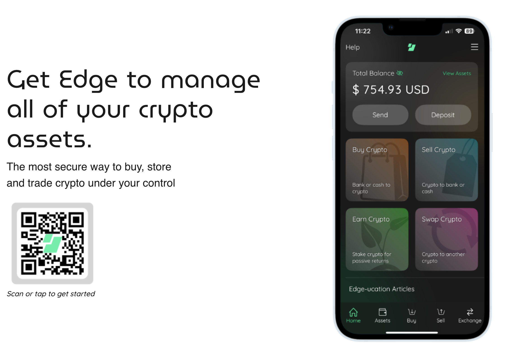

# Module 3: Pratical Usage of Cryptocurrency
## Table of Contents

- [Introduction](#introduction)
- [Hands-on Component](#hands-on-component)
  - [Baby's First On-Ramping (Buying BTC)](#babys-first-on-ramping-buying-btc)
  - [Baby's First Wallet and Key Management](#babys-first-wallet-and-key-management)
  - [Baby's First Transcation](#babys-first-transcation)
  - [Baby's First Currency Swap](#babys-first-currency-swap)
  - [Baby's First Off-ramping](#babys-first-off-ramping)
- [Landscape Overview: CEX, DEXs, and Marketplaces](#landscape-overview-cex-dexs-and-marketplaces)
  - [Fiat-to-Crypto](#fiat-to-crypto-aka-on-ramping)
  - [Crypto-to-Crypto](#crypto-to-crypto)
  - [Crypto-to-Fiat](#crypto-to-fiat)
  - [Crypto-to-Goods/Services](#crypto-to-goodsservices)
  - [Advanced Exchange Technologies](#advanced-exchange-technologies)
- [Conclusion](#conclusion)
- [Key Takeaways](#key-takeaways)
- [Key Terminology](#key-terminology)

## Introduction

Now that you understand the foundational concepts of cryptocurrency and blockchain technology, it's time to get your hands dirty. Module 3 bridges the gap between theory and practice, providing you with concrete experience using cryptocurrency in real-world scenarios.

This module combines hands-on tutorials with a comprehensive overview of the cryptocurrency ecosystem. You'll learn by doing - setting up accounts, managing your own keys, and executing actual transactions. By the end of this module, you'll have practical experience with the entire cryptocurrency lifecycle, from buying your first Bitcoin to swapping currencies and spending crypto on goods and services.

> **Baby's First Crypto** module is going to start from stratch for those who have never "touched" a bitcoin before, and walk through a step-by-step example with specific wallets. 

If you've already taken your first steps into the pratical side of cryptocurrency; you are welcome to follow along with other wallets,exchanges, marketplaces, etc as you will or merely cast a lazy eye over this section and move on to our dicussion of the [Landscape Overview: CEX, DEXs, and Marketplaces](#landscape-overview-cex-dexs-and-marketplaces).

## Hands-on Component

Welcome to your cryptocurrency Christmas morning! Just like a child unwrapping their very first gift, we're about to guide you through the magical process of unwrapping your first Bitcoin. There's something genuinely exciting about holding your own digital money for the first time - watching those cryptographic numbers appear in your wallet, knowing that no bank, government, or institution can take them away from you.

Think of this section as your crypto advent calendar. Each step builds anticipation for the next, from setting up your first exchange account to finally sending your first transaction across the global Bitcoin network. By the time we're done, you'll have gone from crypto-curious to crypto-capable, with real satoshis in your own wallet and the confidence to navigate this brave new financial world.

### Baby's First On-Ramping (Buying BTC)

If Santa or someone special didn't leave your BTC in your stocking on a hardware wallet, you're going to need to buy some to step through this module.

> Choose Your Own Adventure: Kraken or Cashapp

Both require you to verify your identity through a KYC (Know Your Customer) process - show your ID to the bouncer of this exclusive digital crypto club. You'll upload a photo of your driver's license, take a selfie, and sometimes answer a few questions about your financial situation. Then you can buy some Bitcoin. Just like going from USD to EURO, you are going from USD to BTC. It's more like a currency exchange, than a purchase of a new eBook.

- Kraken looks like a Fidelity investment account, it looks familar on the Desktop or Mobile. Kraken is a fully-featured trading platform.

- CashApp might already be on your mobile device, it's good to start buying BTC with little extra setup. 

Option #1: [Kraken](https://www.kraken.com/)


Option #2: [CashApp](https://cash.app/)


Using either of these platforms, buy $200 (or more) of Bitcoin. Just vanilla, nothing special Bitcoin. We'll get to spicier currencies in [Baby's First Currency Swap](#babys-first-currency-swap).

**Recall:** When you buy Bitcoin on these platforms, you don't actually own the Bitcoin yet - the exchange does. It's like having gold stored in someone else's vault with your name on it. The exchange manages all the cryptographic keys (remember those from [Module 2: Keys](../module-2-blockchain/2.1-main-article.md#keys)) on your behalf, which makes things simple but also means you're trusting them with your digital treasure. This is perfectly fine for getting started and small amounts, but as you'll learn in the next section, true Bitcoin ownership means controlling your own keys. 

> CashApp holding the keys for your crypto is similar to when Grandma gave you a $20 bill for your 5th Christmas, it was technically yours, but I bet your parents held on to it for you.

### Baby's First Wallet and Key Management 

This Christmas, Grandpa gave you a leather wallet. A real man's wallet, your first wallet that wasn't made of duct tape in 2nd period english class.

Let's get a real self-custody wallet. I recommend downloading Edge Wallet.

[Downloading Edge Wallet](https://edge.app/)
[Setting up the Edge Wallet](https://edge.app/get-started/?af=edge-app-blog)



Why Edge Wallet? It's designed for privacy, it's easy to use, it allows multiple different types of currencies. They also have a wonderful [set-up guide](https://edge.app/get-started/?af=edge-app-blog). 

>**Save those keys!** Save your recovery passphrase into a password manager. DO NOT write it on a slip of paper under your keyboard, the ghost of my grandma will come berate you for irresponsible handling of her $20 christmas gift.

**Check in:** 
- Bank Account -> $200 BTC in Kraken/CashApp

### Baby's First Transcation

Let's transfer some money! 

**Step #1:** Kraken/CashApp -> Edge Wallet

Since the BTC you now have in Kraken or CashApp isn't really yours fully, let's transfer that to your Edge Wallet. 

1. Add a BTC wallet to your Edge Wallet. 
[TODO: Screenshot]
1. Find the address of your BTC Edge Wallet. 
[TODO: Screenshot]
1. In Kraken/CashApp start to make a transcation to send ALL of your new BTC into Edge Wallet. It will ask for the reciever address, the address to your new Edge Wallet. 
[TODO: Screenshot]
1. Sign and Send. 
1. You will see a transcation ID, save that ID for the moment. Mine looks like this: 
- Sample ID: 98743565658793425768552345897768

[TODO: Actually do this transcation and get an ID to work with.] 

>**Patience, Oh Patience.** Crypto transcations take ~10min to go through. Have patience. An ACH transfer can take up to 3 days, you can wait 10minutes. 

So how do we know it went through? We should be able to see the money arrive in our Edge Wallet. But how else can we check that a transcation went through? That it didn't get catch up in the digital ethos and disappear. Block explorers! 

Recall we talked about open and opaque ledger in [Module 2: Public + Private Blockchains](../module-2-blockchain/2.1-main-article.md#public-vs-private-blockchains). Bitcoin and the transcation you just completed was on the open ledger, meaning it's open to the internet. Let's go take a look. Block explorers are ways we be do investigative work on the blockchain. 

[Block Explorer](https://blockexplorer.one/)

[TODO: Insert a screenshot of block exploer to see the transcation go through]

Clearly, you can see both the sender and reciever addresses plus the amount transferred. If the conenction between address and legal ID is seperate, we might call it psuedonymous. However if the address is publicaly known, everyone and their block exploring grandma can see the whole situation. Consider you used your legal ID to KYC on Kraken or CashApp, they know your name, address, birthday, maybe other finanical details...plus your entire transcation history.

> What you do on the open the blockchain lives forever. Grandma is watching. She may not judge, but she does watch.

Don't worry too much, we will talk about opaque ledgers and real privacy soon!

**Step #2:** Edge Wallet -> Another User

Now you have $200 (or more) on your Edge wallet, in BTC. Now let's say...you are absolutely enjoying this class and want to pay it forward. They say at Christmas time, it's better to give, than to recieve.

Consider, [Tech Learning Collective](https://techlearningcollective.com/) graciously accepts in-kind donations in any amount in support of our work offering unparalleled free, by-donation, and low-cost computer classes to people of marginalized groups and individuals in need. Your donation helps ensure they can continue developing best-in-class educational material on topics ranging from fundamental computer literacy to information and digital security, network engineering, system administration, cryptocurrency, and more.

[TLC Donation Link](https://techlearningcollective.com/donate/)

Here we can see TLC's BTC donation address: 
```
bc1qtchd79gu5t05j7gw8hh7p4gks8ajh7zd7azx0c
```
> **Note** Since we know the connect of organization and address, we can use a block explorer to see all donations and expenses in and out of this account.  

With good 'ol Saint Nick (and my grandma) watching your BTC account, send along a $50 (or more) donation to TLC. Learning any new skills takes time, energy, and repitition. From Edge Wallet, send a transcation to the address above. 

[TODO: Insert screenshot of sending a transcation to TLC's donation link.]

Bonus Activity: Check the [Block Explorer](https://blockexplorer.one/) to see the money get sent.

**Check in:** 
- Bank Account -> $200 BTC in Kraken/CashApp
- Kraken/CashApp -> Edge Wallet $200 BTC
- Edge Wallet -> TLC Donation $50 BTC
- Egde Wallet: $150 BTC 

### Baby's First Currency Swap

But what about privacy? What about other currencies? Just as the US dollar is widely accepted, it's not universally accepted. There are times when we need to change USD for EURO or YEN, in the same vein there are times we want to swap BTC for BTC Lightening or Zcash. For this excerise, we will be swapping BTC for ZEC. Why ZEC? Zcash is a privacy coin, and you'll see what that means in the block explorer. 

> Choose Your Own Adventure: Inter-Wallet or Intra-Wallet

You can perform the currency swap right inside Edge Wallet, this is like using your home back to go from USD to EURO. You can't shop around for the best exchange rates, but it's easy. Or you can swap uses an 3rd party exchange. Let's move $100 BTC to sheiled ZEC.  

Option 1: Inter-Wallet: Edge Wallet

[TODO: Screenshot of the exchange]

Swap out your $100 BTC for sheilded ZEC. Your ZEC address should start with a 'u'. Save the transcation ID, we'll use that in the block explorer. 


Option 2: Intra-Wallet

[TODO: Insert discussion on Trocador or NEAR Intents]

[TODO: Screenshot of the exchange]

Swap out  $100 BTC for sheilded ZEC. Your ZEC address should start with a 'u'. Save the transcation ID, we'll use that in the block explorer. 

[TODO: Insert zcash block explorer and see what you see]

Now's lets go look at what the [Block Explorer](https://blockexplorer.one/)  has to say about the transction. We can see the sender address and amount, but not the reciever address? [TODO: Make this sure is true.]

**Check in:** 
- Bank Account -> $200 BTC in Kraken/CashApp
- Kraken/CashApp -> Edge Wallet $200 BTC
- Edge Wallet -> TLC Donation $50 BTC
- Edge: $100 BTC -> $100 ZEC (minus transcation fees)

If you're actually a Jew who celebrates the 8 days of Hannuka, then consider giving to TLC's ZEC donation link from your newly exchnged BTC -> ZEC. 

Tech Learning Collection ZEC address: 
```
u1mtcsujp9l28hhfvyfmgkt63a6hq5tnamhr29r659m6lhgcuj28getty3y264kaspul2ng53ds9r88vvehtu8fsdjyyncmnqtjqqykknkspf5qdchrw6seykmajcajkvr5fqpnt4eee7rqgj85jv98lwg63juduedqmvj3g9dayle40mywtl8c679rk65dqhndta4pnh9xaysgnfvhsl
```
Save the transcation ID. What do you see now? 

[TODO: Insert a random screenshot of a ZEC sheilded transcation.]

Here we see the different between open and oquare ledgers. We see the difference between BTC and ZEC transcations.

**Check in:** 
- Bank Account -> $200 BTC in Kraken/CashApp
- Kraken/CashApp -> Edge Wallet $200 BTC
- Edge Wallet -> TLC Donation $50 BTC
- Edge: $100 BTC -> $100 ZEC (minus transcation fees)
- Edge Wallet -> TLC Donation $50 ZEC
- Edge Wallet: $50 ZEC and $50 BTC

### Baby's First Off-ramping 

Do you have any BTC left in your stocking? What can you actually DO with bitcoin once you have it? You could save it, invest it, trade it...like a stock. Or you can spend it like cash. For this pratical module, we'll spend it like cash. Introducing....[BitRefill](https://www.bitrefill.com/us/en/). A place that you can buy gift cards with Bitcoin. 

[TODO: Add screenshot bitrefll]

Buy a giftcard with the $50 BTC from your Edge wallet, and now you can spend that gift card on groceries, beer scented soap, or you can use it to tip your favorite sex worker. ;) 

> Grandma and the government isn't watching your Zcash nor your giftcard purchases.

What to do with the remaining ZEC? Save it, swap it, trade it, spend it. No one is watching. 

**Check in:** 
- Bank Account -> Kraken/CashApp $200 BTC
- Kraken/CashApp -> Edge Wallet $200 BTC
- Edge Wallet -> TLC Donation $50 BTC
- Edge: $100 BTC -> $100 ZEC (minus transcation fees)
- Edge Wallet -> TLC Donation $50 ZEC
- Edge Wallet Balance: $50 ZEC and $50 BTC
- Edge Wallet -> Bitrefill: $50 BTC -> Amazon Gift Card 
- Edge Wallet: $50 ZEC

## Hands-on Component Conclusion 

Congratulations! You've just completed your first full cryptocurrency journey - from fiat currency to Bitcoin to Zcash to giftcards. You've experienced the entire crypto lifecycle: on-ramping through a centralized exchange, transferring to self-custody, making transparent and private transactions, swapping between currencies, and off-ramping to real-world goods. More importantly, you've felt the difference between custodial and non-custodial ownership, witnessed the transparency of Bitcoin versus the privacy of Zcash, and learned that cryptocurrency isn't just digital money - it's a fundamentally different way of thinking about financial sovereignty.

The specific path we walked - Kraken/CashApp to Edge Wallet to various transactions - represents just one route through the vast cryptocurrency ecosystem. Like learning to drive on familiar neighborhood streets before hitting the highway, you now have the practical experience to explore the broader landscape of exchanges, wallets, and services we'll discuss next. The skills you've gained (reading addresses, managing keys, understanding transaction fees, using block explorers) are universal tools that work across the entire crypto ecosystem.

## Landscape Overview: CEX, DEXs, and Marketplaces

Cryptocurrency exchanges are platforms that facilitate the buying, selling, and trading of cryptocurrencies. They serve as the primary on-ramps and off-ramps between traditional financial systems and blockchain networks. Kraken was just one explain, here we will continue the discussion.

> The cryptocurrency exchange landscape splits into two fundamental approaches: centralized exchanges (CEXs) and decentralized exchanges (DEXs). 

Centralized exchanges operate much like traditional stock brokerages - they're companies with customer service, regulated operations, and they hold your funds in their custody. Think of them as the "banks" of crypto, offering convenience, user-friendly interfaces, and regulatory compliance, but requiring trust in a central authority. Decentralized exchanges operate entirely on blockchain smart contracts without any central authority. They're more like automated trading posts where you retain full control of your funds, but they require more technical knowledge and offer less hand-holding. CEXs are perfect for beginners and fiat on-ramping, while DEXs shine for experienced users who prioritize self-custody and access to newer, experimental tokens.

### Fiat-to-Crypto aka On-Ramping

Fiat-to-crypto exchanges allow users to purchase cryptocurrency using traditional currencies like USD, EUR, or GBP. These are typically the first point of contact for newcomers to cryptocurrency. This is the "on-ramp" from traditional banking systems to cryptocurrencies.

Fiat-to-Crypto:
**Centralized Exchanges (CEXs):**
- **[Coinbase](https://coinbase.com)**: One of the largest US-based exchanges, publicly traded
- **[Binance](https://binance.us)**: Global exchange with extensive trading pairs and services
- **[Kraken](https://kraken.com)**: Established exchange known for security and compliance
- **[Gemini](https://gemini.com)**: Founded by the Winklevoss twins, focused on institutional clients
- FTX.US: (Note: FTX collapsed in 2022, highlighting exchange risk)

**Other On-Ramping Methods**
- **Mining:** In some sense, mining turns cash into electricity into crypto. 
- **ATMs:** Bitcoin ATMS offer cash to crypto services (often more than just Bitcoin)
- **[zkp2p](https://www.zkp2p.xyz/):** Offers peer-to-peer on-ramping
- **Peer-to-peer:** *Back in my day*...crypto traders gathered in bars and backrooms to exchange physical cash for crypto. Ah, the Craigslist days of crypto. 
- **Goods, Services, and Sugar Daddies:** Getting paid in crypto for goods and services is another way to escape traditional finance systems for the brave new world of digital cash. 

Security Considerations:
- **KYC/AML requirements**: Know Your Customer/Anti-Money Laundering requirements: Most exchanges require identity verification
- **Account limits**: Daily/monthly purchase limits based on verification level
- **Geographic restrictions**: Some exchanges don't serve all countries
- **Regulatory compliance**: Varies by jurisdiction

Best Practices:
- Start with small amounts to test the process
- Use exchanges with strong security reputations
- Enable two-factor authentication (2FA)
- Consider fees when choosing payment methods
- Transfer cryptocurrency to your own wallet after purchase

### Crypto-to-Crypto

Crypto-to-crypto exchanges allow trading between different cryptocurrencies without involving traditional fiat currencies.


**Popular Centralized Exchanges:**
- [Binance.US](https://www.binance.us/): Largest by volume, extensive cryptocurrency selection
- **Coinbase Pro**: Advanced trading interface, good security
- [Kraken](https://www.kraken.com/): Strong security, good for altcoin trading

**Decentralized Exchanges (DEXs):**
- **[Uniswap](https://uniswap.org)**: Leading DEX on Ethereum with automated market making
- **[SushiSwap](https://sushi.com)**: Fork of Uniswap with additional features
- **[PancakeSwap](https://pancakeswap.finance)**: Popular DEX on Binance Smart Chain
- **[dYdX](https://dydx.exchange)**: Decentralized derivatives exchange
- **NEAR Intents**: "The People's Exchange," many smaller cryptocurrencies

**Risk Considerations:**
- **Volatility**: Cryptocurrency prices can change rapidly
- **Liquidity**: Some pairs may have low trading volume
- **Slippage**: Large orders may execute at different prices
- **Exchange risk**: Platform security and solvency concerns

### Crypto-to-Fiat
Crypto-to-fiat exchanges allow users to convert cryptocurrency back to traditional currencies. This is the "off-ramp" from cryptocurrency to traditional banking systems.

[TODO: Insert how it's basically the same, CEXs, peer-to-peer, etc]

**Tax Implications:**
- **Capital gains**: Cryptocurrency sales are typically taxable
- **Cost basis tracking**: Essential for accurate tax reporting
- **Transaction history**: Keep detailed records of all trades
- **Reporting requirements**: Varies by jurisdiction

**Best Practices:**
- Plan for taxes before selling large amounts
- Use exchanges with good liquidity for your cryptocurrency
- Consider timing to minimize fees and maximize value
- Transfer to your own wallet before selling if possible
- Keep detailed records of all transactions

### Crypto-to- Goods/Services

Of course, if we have digital cash we can use it to purchase goods, services, gift cards, or other non-cryptocurrency items. This represents the practical use of cryptocurrency as a medium of exchange beyond speculative trading.

**Cryptocurrency Marketplaces:**
- **[OpenBazaar](https://openbazaar.org/)**: Decentralized marketplace with no fees
- **[Purse.io](https://purse.io/)**: Amazon purchases with Bitcoin (discontinued, but concept remains)
- **[Paxful](https://paxful.com/)**: Peer-to-peer marketplace for goods and services
- **[LocalCryptos](https://localcryptos.com/)**: Local cryptocurrency trading and services

**Gift Card and Refill Services:**
- **[Bitrefill](https://bitrefill.com/)**: Gift cards for major retailers (Amazon, Walmart, Target)
- **[Gyft](https://gyft.com/)**: Gift cards purchased with Bitcoin
- **[eGifter](https://egifter.com/)**: Gift cards for various merchants
- **Gaming credits**: Steam, Xbox, PlayStation gift cards

**Direct Goods and Services:**
- **Travel**: [Locktrip](https://locktrip.com) or [Travala](https://travala.com)

**Payment Processors:**
- **[BitPay](https://bitpay.com/)**: Business payment processing for cryptocurrency
- **[Coinbase Commerce](https://commerce.coinbase.com/)**: E-commerce cryptocurrency payments
- **[Stripe](https://stripe.com/)**: Traditional payment processor with crypto options
- **[Shopify](https://shopify.com/)**: E-commerce platform with crypto payment plugins

**Advantages of Crypto-to-Goods/Services:**
- **Privacy**: Some transactions offer more privacy than traditional payments
- **Global access**: No geographic restrictions on cryptocurrency payments
- **Lower fees**: Often lower transaction fees than traditional payment methods
- **No chargebacks**: Irreversible transactions reduce fraud risk for merchants

### Advanced Exchange Technologies

**Aggregator Services** like Trocador provide enhanced security and efficiency by connecting multiple exchanges through a single interface. These services offer several advantages over using individual exchanges directly.

**How Trocador Works:**
- **Multi-exchange routing**: Automatically finds the best rates across multiple exchanges
- **No account creation**: Users don't need to create accounts on individual exchanges
- **Direct wallet transfers**: Cryptocurrency goes directly to your wallet, not through exchange accounts
- **Rate comparison**: Shows real-time rates from multiple exchanges simultaneously

**Security Benefits:**
- **Reduced exposure**: No need to keep funds on exchange accounts
- **No KYC requirements**: Many aggregators don't require identity verification for small amounts
- **No account risk**: Eliminates risk of exchange account compromise
- **Privacy protection**: Reduces transaction tracking and profiling

**Other Similar Technologies:**
- **1inch**: Popular DEX aggregator for decentralized exchanges
- **ParaSwap**: Another DEX aggregator with advanced routing
- **Changelly**: Fiat-to-crypto and crypto-to-crypto exchange aggregator
- **ChangeNOW**: Instant cryptocurrency exchange service

Remember: While aggregator services like Trocador can enhance security and efficiency, they're not a replacement for proper security practices. Always use reputable services, keep most funds in your own wallets, and maintain good security hygiene regardless of the exchange method used.

## Conclusion

## Key takeaways

# Key Terminology