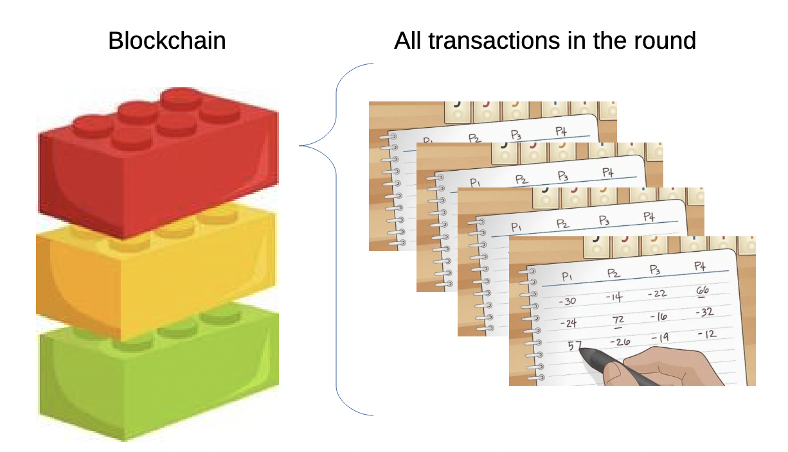
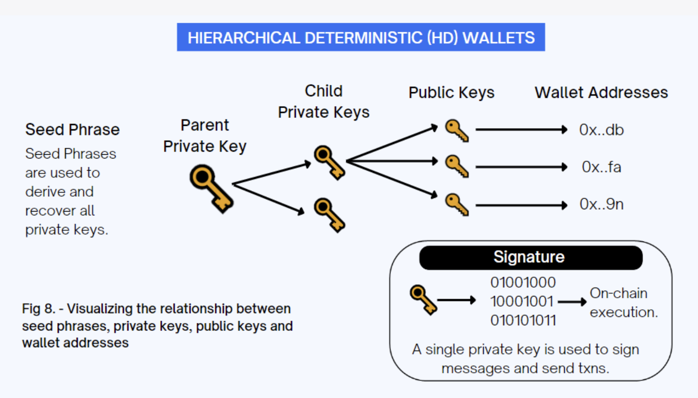

# Module 2: Blockchain Technology Demystified

## Table of Contents

- [Introduction](#introduction)
- [What is Blockchain?](#what-is-blockchain)
- [How Blockchain Works](#how-blockchain-works)
- [Mining and Consensus Mechanisms](#mining-and-consensus-mechanisms)
- [Public vs Private Blockchains](#public-vs-private-blockchains)
  - [Public Blockchains](#public-blockchains)
  - [Private Blockchains](#private-blockchains)
  - [Choosing the Right Approach](#choosing-the-right-approach)
- [Smart Contracts](#smart-contracts)
- [Blockchain Security](#blockchain-security)
- [Apps, Wallets, and Addresses](#apps-wallets-and-addresses)
  - [Wallet Apps](#wallet-apps)
  - [Hot vs Cold Wallets](#hot-vs-cold-wallets)
  - [Addresses](#addresses)
- [Keys](#keys)
  - [Private Keys vs Public Keys](#private-keys-vs-public-keys)
  - [Recovery Passphrases (Seed Phrases)](#recovery-passphrases-seed-phrases)
  - [Recovery Passphrase Storage Recommendations](#recovery-passphrase-storage-recommendations)
  - [Recovery Process](#recovery-process)
  - [Security Considerations](#security-considerations)
- [Conclusion](#conclusion)
- [Key Takeaways](#key-takeaways)
  - [Understanding Blockchain Technology](#understanding-blockchain-technology)
  - [Consensus Mechanisms](#consensus-mechanisms)
  - [Blockchain Types and Use Cases](#blockchain-types-and-use-cases)
  - [Security and Key Management](#security-and-key-management)
  - [User Interface and Applications](#user-interface-and-applications)
- [Review of Key Terminology](#review-of-key-terminology)

## Introduction

While Module 1 introduced you to the basics of crypto, Module 2 dives deep into the foundational technology that makes it all possible: blockchain. Understanding blockchain technology is essential because it's not just the foundation of cryptocurrency—it's rapidly becoming a transformative force across multiple industries, from finance and supply chain management to healthcare and government services.

## What is Blockchain?

At its most fundamental level, a blockchain is an immutable database, a ledger that can't be changed or altered. This is exactly what we want when it comes to money, a records system that no one can tamper with, go back and change a transaction, or arbitrarily add zeros to an account balance. The term "blockchain" comes from its structure: data is stored in blocks, and these blocks are linked together in a chain using cryptographic techniques. 

In my house growing up, we played alot of the tile game Rummikub. Using numbered colored tiles, you make runs (3,4,5,6) or sets (3,3,3). You can restructure the whole playing field to get play out your tiles. Played in rounds, at the end of each round (block) the score is tallied on an **immutable** ledger.  


In Rummikub, winner takes all the points as positive held unplayed by the other players. The non-winners in the round, take those points as negative. The tally sheet records those who **gain** points (money) and those who **lose** points (money) from their record/bank account.

| Round # | Mylo | Mom | Dad | Sibling |
|----------|----------|----------|----------|----------|
| Round 1    |  38    | -10| -25| -3|
| Round 2   |   -7 | 76 | -57| -12|
|-|-|-|-|-|
| Running Score  |   31   | 66  | -82| -15|

In round 1, I win and score 38 points, the sum of all the unplayed points in Mom's, Dad's, and Sibling's hands. They take those points as negative. In round two Mom wins, and catches Dad with a joker in his hand, valued at 50 points.The running scores are tallied down the columns, but notice the sum of each row is 0. This is a nice check-sum feature to be sure the points are all tallied correctly, no points (or money) are created or destroyed in each round. At the end of each round (block), the running score is tallied across all players (transcations).

Now imagine there are hundreds to millions of indepdent Rummikub games, and everh 10m inutes the rounds finish and the ledger of who won and lost each game is talled. Except when we played, ususaly 1 person was elected to keep the tally and it was mostly their responsibility to keep the scores accurate. In the blockchain ledger, no one person is responsibile and therefore I don't have to trust that my sibling added the points correctly. 

Perhaps you can already see the parallel to the banking system, I had to trust my sibling (the bank) kept and accurate tally of all my transcations. When I buy $200 of York peppermint patties, it's deducted from my tally and added to The Hershey Company. The sum across the transcation is zero, just like Rummikub and blockchains. That's the way its supposed to work with money. However, with the blockchain, at the end of each round, all the transcations in the world are gathered, verified, and sealed in a block. That block is added to the chain of all other rounds before it. 



The blockchain digital ledger is maintained by thousands of computers simultaneously, each holding an identical copy. When a new transaction occurs, it's broadcast to the entire network. The network then works by consensus to verify the transaction and add it to a new block. Once a block is full of transactions, it's cryptographically linked to the previous block, creating an unbreakable chain that goes back to the very first block—the genesis block.

Let's add 1 more wrinkle now: Bitcoin mining. In this game, the Miner gets points for validating each transcation and creating the block. 

| Round # | Mylo | Mom | Dad | Sibling | Miner |
|----------|----------|----------|----------|----------|----------|
| Round 1    |  38    | -10, -1| -25, -1| -3, -1| + 3| 
| Round 2   |   -7, -1 | 76 | -57, -1| -12, -1 | + 3 |
|-|-|-|-|-|
| Running Score  |   30   | 65  | -84| -17| 6 |

See how in Rummikub, you can't get the Round 4 tally without also having information about Rounds 1-3. This is exactly how the blockchain works, with each round/block build upon the previous round. Once the block is signed, there is no going back.

What makes blockchain revolutionary is its combination of three key properties:
1. Decentralization
1. Transparency
1. Immutability

Unlike traditional databases that are controlled by a single entity (my sibling in Rummikub), blockchains are distributed across a network of computers, with no single point of control. Every transaction is visible to everyone on the network, creating unprecedented transparency. And once data is recorded on the blockchain, it cannot be altered or deleted. It becomes permanent and immutable*.

> *Yes I put an asterick on this. Hodl that thought. We'll review a case study of the 51% attack on Monero later in course.

## How Blockchain Works

To understand how blockchain works, let's walk through the process of a typical transaction. Imagine Alice wants to send 1 Bitcoin to Jared. Here's what happens:

First, Alice creates a transaction using her digital wallet. This transaction includes Jared's public address (like an email address), the amount she wants to send, and a digital signature that proves she owns the Bitcoin she's trying to spend. The digital signature is created using Alice's private key, a secret number that only she knows.

> Just like an email address is public, so are wallet addresses. It's only anonoymous so long as the link between real human and address is private. Hence its often refered to as pseudoanonimity.  

Once Alice submits the transaction, it's broadcast to the entire Bitcoin network. Thousands of computers around the world receive this transaction and begin the verification process. They check several things: Does Alice actually own the Bitcoin she's trying to spend? Has she already spent this Bitcoin elsewhere? Is the transaction properly formatted? Just like Rummikub, they look through the chain of all of Alice's transcations to check that it all tallies up, such that Alice as **unspent transaction outputs (UTXOs)**, aka money on her ledger.

If the transaction passes all these checks, it gets added to a pool of pending transactions waiting to be included in the next block. Her transcations from her game of Rummikub waits in the queue, usually at most 10minutes, for others to finish their rounds and submit transcation/round scores. This is where mining comes in; miners compete to solve a complex mathematical puzzle, with the winner getting to create the next block of transactions and taking the prize (paid via the transcation fee).

When a miner successfully creates a new block, it includes Alice's transaction along with many others. The block is then cryptographically linked to the previous block in the chain, and the entire network updates their copies of the blockchain to include this new block. At this point, Alice's transaction is confirmed and becomes part of the permanent record. 

The beauty of this system is that it eliminates the need for trust in a central authority. Instead of relying on a bank to verify and record the transaction, the entire network works together to ensure accuracy and security. This distributed approach makes the system incredibly robust as there's no single point of failure, and no single entity can control or manipulate the network.

> Fun Fact: When we were little, my sibling and I would often collude against my father by trading Rummikub tiles under the table. Consensus and collusion are 2 sides of the same tile. ;)

### Optional "Well, Actually..." Section: UTXO vs Account Model

The "Well, actually..." asshole in the group may point out that **unspent transaction outputs (UTXOs)** is specifically how Bitcoin (and it's offshoots) handles the ledger. This is like physical bills, you have a $10, a $5, and a $1 bill. You have cents that go down to a penny, but that's it. Bitcoin's smallest unit is the SAT or Satoshi. It's the cents to the dollar. Simply put, BTC deals in integers. 

You may be thinking, right that's how money works. 

Recall, the skimming half-penny scheme from real life and the movie "Office Space". This requires half-pennies...which doesn't exist in our phsyical world. It's a function of digital calculation, floating decimal points. Etherum is uses an **Account-based model** for it's ledger. Simply: It allow decimal point mathematics. 

This is purely an implementation detail, and you do not need to know it to functional happily in the cryptocurrency world. You can live happily without ever storing UTXOs in your brainspace. I won't mention it again. 

UXTOs: Bitcoin, Bitcoin Lightening, DOGECoin, Zcash, ...

Account Model: Etherum, Solan, Tron, ...

## Mining and Consensus Mechanisms

Mining is one of the most misunderstood aspects of blockchain technology, but it's absolutely crucial to how many blockchains operate. At its core, mining is the process by which new transactions are verified and added to the blockchain. But it's also the mechanism of creating new cryptocurrency and securing the network against attacks.

### Proof of Work (PoW)

Let's break down how mining works in the Bitcoin network. Every 10 minutes or so, a new block of transactions needs to be added to the blockchain. To determine who gets to create this block, the network uses a consensus mechanism **Proof of Work**. Here's how it works:

The network creates a mathematical puzzle that's extremely difficult to solve but easy to verify. This puzzle involves finding a number (called a nonce) that, when combined with the block's data and run through a cryptographic hash function, produces a result that meets certain criteria. The criteria are designed to make the puzzle so difficult that it takes significant computational power to solve.

Miners around the world compete to solve this puzzle first. They run their computers at full capacity, trying different nonces until one of them finds the solution. The first miner to solve the puzzle gets to create the new block, add it to the blockchain, and receive a reward in the form of **newly created Bitcoin** plus any transaction fees.

> The miner gets a double payout: transcation fee + mining prize. Prize >> fee. 

This system serves several important purposes. First, it creates new Bitcoin in a controlled, predictable way. Second, it secures the network by making it extremely expensive to attack. To successfully attack the Bitcoin network, an attacker would need to control more than 50% of the total mining power. This feat that would require billions of dollars worth of specialized hardware.

**!! But wait:** Aren't they just mining new Bitcoin every 10 minutes? That sounds like a serious hyperinflation risk! Yes and no. Bitcoin made a finanical policy around this, there is a fixed supply. Mining is like a controlled release valve on that 21 million bitcoin vault. The prize per block undergoes a "halving" event every ~4 years, where they are gradually turning down the valve until around the year 2140 when it finally shuts off completely.

Ethereum took a different approach to the inflation problem. Since it doesn't cap total ETH supply, each transaction fee is split into two parts: a base fee (which gets burned) and a priority tip (which goes to validators).
Think of your transcation taking an Uber or taxi. You have to pay for gas and the driver, with an option to tip your taxi cab driver for speed.   

Gas = The amount of computational work your transaction requires (like "miles driven")

* Simple transfer: ~21,000 gas units
* Complex smart contract: ~200,000+ gas units

Base fee = The price per unit of gas (like "dollars per mile")

* Changes dynamically based on network congestion
* Gets burned like gasoline

Priority tip = Extra payment per unit of gas to validators (like a tip)

* Goes to validators as their reward
* Optional but helps get your transaction processed faster

What validators actually receive: (Priority tip × Gas used) + miner's reward = Validator payment 

What gets burned: Base fee × Gas used = Amount destroyed

By "burned" we mean like gasoline, it's not going anywhere but into the ether. The interesting part: During high network activity, Ethereum can actually become deflationary - more ETH gets burned than created! It's like having an economy where busy periods actually shrink the money supply. This also prevents the hyperinflation economoics.

However, Proof of Work has significant drawbacks, particularly its environmental impact (like driving cars and burning gas). The computational power required for mining consumes enormous amounts of electricity, leading to concerns about sustainability. This has led to the development of alternative consensus mechanisms.

### Other Consensus Mechanisms
**Proof of Stake (PoS)** is one such alternative that's gaining popularity. Instead of using computational power to secure the network, PoS uses economic incentives. Validators (the equivalent of miners) must "stake" a certain amount of cryptocurrency as collateral. If they behave honestly, they earn rewards. If they try to attack the network, they lose their stake. This is similar to buying a dividend yeilding bond, you stake the cash, tie it up in the bond, but get the reward of a dividend. 

> A jaded crypto miner may point out that, PoW requires a computer to be running all the time and for some blockchains a moderately priced home desktop may be enough to join a mining pool and earn rewards. In PoS, often larger amounts of capital are required to earn rewards. The rich get richer under PoS, where PoW gives the option for smaller operations to turn a profit. A rural community with a water mill, internet connection, and a desktop could mine but it takes larger ammounts of starter crypto to stake enough to get rewards with a PoS system. 

Other consensus mechanisms include **Delegated Proof of Stake**, where token holders vote for validators, and **Proof of Authority**, where trusted entities are given the right to create blocks. Each mechanism has its own trade-offs in terms of security, decentralization, and efficiency.

## Public vs Private Blockchains

Not all blockchains are created equal, and understanding the differences between public and private blockchains is crucial. The choice between public and private blockchains can have significant implications for business applications, regulatory compliance, and security.

### Public Blockchains

Public blockchains, like Bitcoin and Ethereum, are open to anyone. Anyone can download the software, join the network, and participate in the consensus process. These networks are truly decentralized, with no single entity in control. They offer maximum transparency and censorship resistance, but they also have limitations in terms of scalability and privacy.

**Open Ledger:** Bitcoin operates where every transaction is visible to everyone. Think of it like a public checkbook where anyone can see all the deposits, withdrawals, and transfers. This transparency provides several benefits: it prevents fraud, enables audit trails, and ensures no one can create money out of thin air. However, it also means that transaction patterns, wallet balances, and spending habits are visible to anyone who cares to look.

**Opague Ledger:** Some cryptocurrencies like Zcash operate where transaction details are encrypted and hidden from public view. Think of it like a private checkbook where only the account holders know the details of their transactions. The network still validates that transactions are legitimate (no double-spending, sufficient funds, etc.), but the actual amounts, sender, and receiver remain confidential. This provides the privacy benefits of physical cash while maintaining the security and global accessibility of digital transactions.

### Private Blockchains

Private blockchains, on the other hand, are controlled by a single organization or consortium. Access is restricted to authorized participants, and the consensus process is typically much simpler and faster. Private blockchains can offer better performance and privacy, but they sacrifice some of the decentralization and transparency that make public blockchains revolutionary.

### Choosing the Right Approach

The choice between public vs private; open vs opaque ledgers often comes down to the specific use case:

- **Public Blockchains** is using the roadways, parks, and bridges built by the community. It's pubically accessible, althought sometimes with a fee. (Just like a useage fee at a National Park.) There is no need to maintain infrastructure

- **Private Blockchain** is building your own private driveway, mowing the lawn, and building your own house. It's private and privately maintained. Perhaps a good choice for companies looking to own the whole software stack.

- **Open ledgers** like Bitcoin are ideal for applications requiring transparency and auditability, such as public registries or systems where trust is built through visibility.

- **Opaque ledgers** like Zcash are better suited for applications requiring privacy, such as personal transactions, business dealings, or situations where financial privacy is a priority.

## Apps, Wallets, and Addresses

Okay, we have a ledger, how do we make entries? Let's talk about how users actually can interact with blockchain technology. The interface between humans and blockchain networks comes through applications, wallets, and addresses, each serving distinct but interconnected purposes.

Transcations step-by-step:

1. Key Generation: The wallet generates a matching pair of public and private keys.

1. Transaction Signing: When sending crypto, your wallet uses your private key to sign the transaction.

1. Blockchain Validation: The network validates your transaction using your public key.

1. Funds Received or Sent: The blockchain records the change in ownership.

Your crypto never leaves the blockchain, it simply changes ownership based on key authorization. Like how Santander has a digital record of funds, and is not moving physical dollar bills around from a box labeled "Mylo" to a box labeled "Fazio's Pizzeria". Crypto is merely updating the ledger, the listing of accounts; the funds aren't actually on your phone or in your wallet.  

We will have a hands-on unit in [Module 3](../module-3-practical-usage/) to put this discussion into pratice.

### Wallet Apps

**Cryptocurrency applications** (often called "dApps" or decentralized applications) are software programs that interact with blockchain networks. These applications provide user-friendly interfaces for complex blockchain operations, making cryptocurrency accessible to non-technical users.

1. My favorite: **Zashi** is a specialized mobile wallet developed by the Electric Coin Company specifically for Zcash (ZEC). Unlike multi-currency wallets, Zashi focuses exclusively on shielded ZEC transactions, making it the premier choice for users who prioritize maximum financial privacy. The app features seamless integration with Coinbase for purchasing ZEC directly within the wallet and partnerships with Flexa for spending ZEC at thousands of retail locations. Zashi emphasizes true self-custody while maintaining a user-friendly interface accessible to cryptocurrency newcomers. The wallet also includes innovative privacy features like decentralized off-ramps for converting shielded ZEC to other cryptocurrencies without compromising transaction privacy. 

1. **MetaMask** is perhaps the most popular cryptocurrency app, serving as both a wallet and a gateway to the Ethereum ecosystem. Think of MetaMask as a "browser for blockchain" that allows users to connect to decentralized applications, manage their cryptocurrency holdings, and interact with smart contracts. MetaMask stores private keys locally on the user's device, providing security while maintaining accessibility.

1. **Edge Wallet** is another popular option for privacy-minded folks, particularly for mobile users. It supports multiple cryptocurrencies and provides features like built-in exchange functionality, allowing users to trade between different cryptocurrencies without leaving the app. Edge Wallet also emphasizes security through features like biometric authentication and encrypted storage.

>**Note** The term "wallet" can be very confusing, vague, and imprecise. Sometimes it refers to the App, sometimes the currency-speicifc container inside an App, and sometimes the address to that currency-speicifc container. 

[TODO: Insert some screenshots of wallets and apps, with different wallets, and addresses.]

Other notable apps include:
- **Trust Wallet**: Mobile-first wallet with support for thousands of cryptocurrencies
- **Exodus**: Desktop wallet with built-in exchange and portfolio tracking
- **YWallet**: Multi-address capibilitiy with labeling features

Each app has different security features, and different supported cryptocurrencies. 

### Hot vs Cold Wallets

**Digital Wallets (Hot Wallets)** are software-based wallets that are connected to the internet (ex. Edge Wallet). They offer convenience and accessibility but come with increased security risks.

Advantages of Digital Wallets:
- Easy to use and set up
- Quick access to funds for trading
- Integration with DeFi protocols and dApps
- Real-time balance updates
- Backup and recovery options

Disadvantages of Digital Wallets:
- Vulnerable to hacking and malware
- Dependent on device security
- Risk of losing funds if device is compromised
- Limited protection against user error

**Hardware Wallets (Cold Wallets)** are physical devices that store private keys offline, providing the highest level of security for cryptocurrency storage.

Advantages of Hardware Wallets:
- Maximum security through offline storage
- Protection against malware and hacking
- Physical confirmation required for transactions
- Long-term storage solution
- Backup and recovery capabilities

Disadvantages of Hardware Wallets:
- Higher cost (typically $50-200)
- Less convenient for frequent trading
- Risk of physical damage or loss
- Learning curve for setup and use
- Limited integration with DeFi protocols

**Popular Hardware Wallet:**
- **Ledger**: Industry standard with support for thousands of cryptocurrencies

The choice between digital and hardware wallets often depends on use case. Digital wallets are suitable for active traders and DeFi users who need frequent access to their funds. Hardware wallets are better for long-term investors and those holding significant amounts of cryptocurrency.

### Addresses

**Cryptocurrency addresses** are alphanumeric strings that serve as destinations for cryptocurrency transactions. Think of them as email addresses for cryptocurrency. They're public information that others can use to send you cryptocurrency, but they don't reveal your identity or give access to your funds.

**Key Characteristics of Addresses:**
1. **Public Information**: Addresses are meant to be shared publicly
2. **Cryptographically Generated**: Created from private keys using mathematical functions
3. **Unique**: Each address is mathematically unique
4. **Reusable**: Can receive multiple transactions
5. **Pseudonymous**: Don't directly reveal user identity

**Security Considerations:**
- **Address verification**: Always double-check addresses before sending
- **QR codes**: Many wallets use QR codes to prevent typing errors
- **Address book**: Save frequently used addresses to avoid mistakes
- **Test transactions**: Send small amounts first when using new addresses

> **Note** Like having a burner phone for a single use with call forwarding, some wallets allow you to create new addresses for single-use transactions that link back to a consolidated wallet. 

The relationship between wallets and addresses creates the user experience that makes blockchain technology accessible. **Wallets manage the keys, and addresses enable the transactions.** Together they form the foundation of practical cryptocurrency usage. 

[TODO replace this image with one of my own, tailored for this discussion]



## Keys
Since we mention that wallets manage keys, lets talk about them. 

Cryptographic keys are the foundation of blockchain security and cryptocurrency ownership. Understanding how keys work is essential for anyone using blockchain technology, as they represent the only way to access and control cryptocurrency holdings.

### Private Keys vs Public Keys

**Private keys** are the most critical component of cryptocurrency security. Think of a private key as the master password to your cryptocurrency holdings. It's a long string of random numbers and letters that proves ownership of cryptocurrency on the blockchain. Whoever controls the private key controls the cryptocurrency.

> **Warning** You may notice apps like Venmo and CashApp have "crypto" components, but...if you don't own the keys, you don't own the money. 

**Public keys** are derived from private keys using mathematical functions. They serve as the "address" where others can send you cryptocurrency. While public keys can be shared freely, private keys must be kept secret at all times.

The relationship between private and public keys is one-way: you can generate a public key from a private key, but you cannot reverse the process to find the private key from the public key. This mathematical relationship is what makes blockchain security possible.

### Recovery Passphrases (Seed Phrases)

**Recovery passphrases** (also called seed phrases, mnemonic phrases, or backup phrases) are human-readable versions of private keys. Instead of a long string of random characters, they consist of 12, 15, 18, 21, or 24 common words in a specific order.

**Example of a 12-word recovery passphrase:**
```
abandon conserve finance chair above boat deflect abstract calibrate waterway access maple
```

### Recovery Passphrase Storage Recommendations

Physical Storage (Recommended for long-term holdings):
- **Fireproof safe**: Store in a fireproof safe or safety deposit box
- **Multiple locations**: Keep copies in different secure locations
- **Metal backup**: Consider metal backup plates that survive fire/water damage
- **Off-site storage**: Keep one copy in a different building or city

Digital Storage (Use with extreme caution):
- **Encrypted files**: Store in encrypted files with strong passwords
- **Password managers**: Use reputable password managers with 2FA (like Bitwarden or 1Pass)
- **Never plain text**: Never store passphrases in unencrypted text files
- **Air-gapped devices**: Consider dedicated devices not connected to the internet

What NOT to do:
- ❌ Store on cloud services (Google Drive, iCloud, etc.)
- ❌ Send via email or messaging apps
- ❌ Store on shared computers
- ❌ Take photos with smartphones
- ❌ Share with family members "just in case"
- ❌ Store in password managers without 2FA

### Recovery Process

When setting up a new wallet:
1. Write down the recovery passphrase immediately
1. Verify each word is spelled correctly
1. Test the recovery process before storing any cryptocurrency
1. Store the passphrase securely before adding funds

If you lose access to your wallet:
1. Use the recovery passphrase to restore access
1. Transfer funds to a new wallet with a new passphrase
1. Never reuse compromised passphrases

### Security Considerations

Physical security is often more important than digital security for recovery passphrases. Consider:
- Fire damage to paper backups
- Water damage in floods
- Theft from homes or offices
- Natural disasters

Social engineering attacks target recovery passphrases through:
- Phishing emails claiming to be from wallet providers
- Fake customer support calls
- Malicious software that scans for passphrases
- Shoulder surfing when entering passphrases

> Remember: Your private keys and recovery passphrases are the only things standing between your cryptocurrency and potential loss. "Not your keys, not your crypto"

Treat them with the same care you would treat physical gold or cash. The convenience of digital currency comes with the responsibility of proper key management. 

## Smart Contracts

Now that we have a ledger, with the address to entries, how can we build on it? A smart contract is essentially a computer program that automatically executes actions on the ledger when certain conditions are met. Unlike traditional contracts that rely on legal enforcement, smart contracts are enforced by code. Code that can be audited.

**Use Case:** Imagine a traditional escrow service where a buyer and seller use a third party to hold funds until the transaction is completed. With a smart contract, this entire process can be automated. The buyer sends cryptocurrency to a smart contract address. The seller ships the product. When the buyer confirms receipt, the smart contract automatically releases the funds to the seller. If there's a dispute, the smart contract can hold the funds until the dispute is resolved.

The implications of smart contracts are enormous. They can automate complex financial transactions, reduce the need for intermediaries, and create new types of financial instruments. For example, smart contracts can be used to create automated insurance policies that pay out immediately when certain conditions are met, or to create complex derivative instruments that automatically settle based on market conditions.

However, smart contracts also present new challenges. They're only as good as the code they're written in, and bugs in smart contract code can lead to significant financial losses. 

[TODO: Turn this into a whole case study.]

The infamous [DAO hack in 2016](https://www.coindesk.com/consensus-magazine/2023/05/09/coindesk-turns-10-how-the-dao-hack-changed-ethereum-and-crypto), where attackers exploited a bug in a smart contract to steal millions of dollars worth of Ethereum, is a cautionary tale about the importance of proper smart contract development and auditing.

## Conclusion

Blockchain technology represents a fundamental shift in how we think about data, trust, and value. Understanding blockchain is not just about staying current with technology trends. It's about understanding the future of finance itself.

## Key Takeaways

### **Understanding Blockchain Technology**
- **Blockchain Structure**: Data stored in blocks linked by cryptography, creating an immutable ledger
- **Decentralization**: Distributed across thousands of computers with no single point of control
- **Transparency**: All transactions visible to network participants (except privacy-focused chains)
- **Immutability**: Once recorded, data cannot be altered or deleted

### **Consensus Mechanisms**
- **Proof of Work (PoW)**: Miners solve complex puzzles to validate transactions and create new blocks
- **Proof of Stake (PoS)**: Validators stake cryptocurrency as collateral to secure the network
- **Alternative Mechanisms**: Delegated PoS, Proof of Authority, and other consensus models
- **Security Trade-offs**: Each mechanism balances security, decentralization, and efficiency

### **Blockchain Types and Use Cases**
- **Public Blockchains**: Open to anyone, maximum transparency and decentralization (Bitcoin, Ethereum)
- **Private Blockchains**: Controlled by organizations, better performance and privacy
- **Open vs Opaque Ledgers**: Transparency vs privacy considerations for different applications
- **Smart Contracts**: Self-executing agreements that automate complex financial transactions

### **Security and Key Management**
- **Cryptographic Security**: Advanced encryption protects transactions and ownership
- **Private Keys**: Master passwords that control cryptocurrency holdings
- **Recovery Passphrases**: Human-readable backups of private keys (12-24 words)
- **Wallet Types**: Hot wallets (connected) vs cold wallets (offline) for different security needs

### **User Interface and Applications**
- **Cryptocurrency Apps**: User-friendly interfaces for blockchain interactions (MetaMask, Edge Wallet)
- **Wallet Functions**: Store private keys, manage transactions, and provide security
- **Addresses**: Public destinations for receiving cryptocurrency (like email addresses)

> [!note] Remember: Blockchain technology is still in its early stages of mass adoption, and the landscape is constantly evolving. The most successful will be those who continue to learn and adapt as the technology matures and new applications emerge.

## Review of Key Terminology

- **51% Attack**: A theoretical attack where a single entity gains control of more than half of a network's mining power or stake.

- **Aggregator Service**: Platforms that connect multiple exchanges through a single interface to find the best rates and enhance security.

- **AML (Anti-Money Laundering)**: Regulations designed to prevent money laundering and terrorist financing through financial systems.

- **Consensus Mechanism**: The method by which blockchain networks agree on the validity of transactions and maintain network security.

- **Digital Wallet (Hot Wallet)**: Software-based cryptocurrency storage that is connected to the internet for easy access.

- **Gas Fee**: A transaction fee paid to miners or validators for processing transactions on a blockchain network.

- **Hardware Wallet (Cold Wallet)**: Physical devices that store private keys offline for maximum security.

- **Hash Function**: A mathematical function that converts input data into a fixed-size string of characters, used to link blocks in a blockchain.

- **Immutability**: The characteristic of blockchain data that makes it impossible to alter or delete once recorded.

- **KYC (Know Your Customer)**: Regulatory requirements for financial institutions to verify customer identities.

- **Mining**: The process of validating transactions and creating new blocks in a blockchain, typically involving solving complex mathematical puzzles.

- **Nonce**: A random number used in mining that, when combined with block data, produces a hash meeting specific criteria.

- **Open Ledger**: A blockchain where all transactions are publicly visible, like Bitcoin's transparent transaction history.

- **Opaque Ledger**: A blockchain where transaction details are encrypted and hidden from public view, like Zcash's privacy features.

- **Private Key**: A secret cryptographic key that provides access to cryptocurrency holdings and must be kept secure.

- **Proof of Stake (PoS)**: A consensus mechanism where validators are chosen based on the amount of cryptocurrency they "stake" as collateral.

- **Proof of Work (PoW)**: A consensus mechanism where miners compete to solve mathematical puzzles to validate transactions and create new blocks.

- **Public Key**: A cryptographic key derived from the private key that serves as the address for receiving cryptocurrency.

- **Recovery Passphrase (Seed Phrase)**: A human-readable backup of private keys consisting of 12-24 words in a specific order.