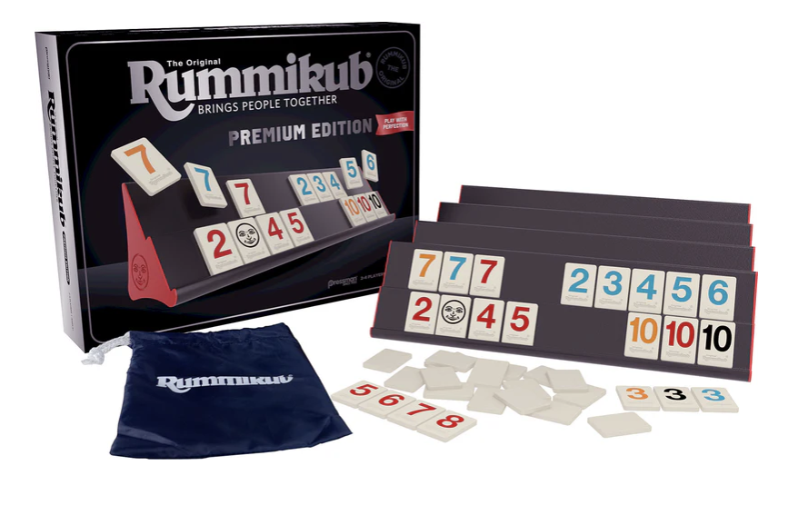
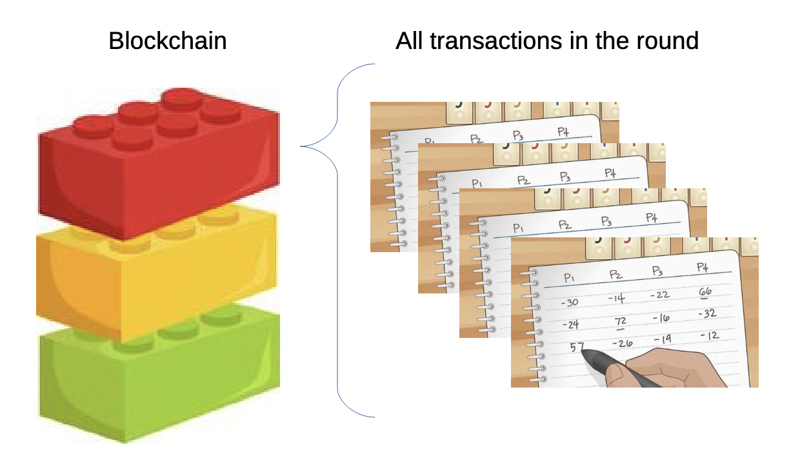

# Introduction & What is Blockchain?

## Introduction

While Module 1 introduced you to the basics of crypto, Module 2 dives deep into the foundational technology that makes it all possible: blockchain. Understanding blockchain technology is essential because it's not just the foundation of cryptocurrency—it's rapidly becoming a transformative force across multiple industries, from finance and supply chain management to healthcare and government services.

## What is Blockchain?

At its most fundamental level, a blockchain is an immutable database, a ledger that can't be changed or altered. This is exactly what we want when it comes to money, a records system that no one can tamper with, go back and change a transaction, or arbitrarily add zeros to an account balance. The term "blockchain" comes from its structure: data is stored in blocks, and these blocks are linked together in a chain using cryptographic techniques. 

In my house growing up, we played a lot of the tile game Rummikub. Using numbered colored tiles, you make runs (3,4,5,6) or sets (3,3,3). You can restructure the whole playing field to get play out your tiles. Played in rounds, at the end of each round (block) the score is tallied on an **immutable** ledger.  

In Rummikub, winner takes all the points as positive held unplayed by the other players. The non-winners in the round, take those points as negative. The tally sheet records those who **gain** points (money) and those who **lose** points (money) from their record/bank account.

| Round # | Mylo | Mom | Dad | Sibling |
|----------|----------|----------|----------|----------|
| Round 1    |  38    | -10| -25| -3|
| Round 2   |   -7 | 76 | -57| -12|
|-|-|-|-|-|
| Running Score  |   31   | 66  | -82| -15|

In round 1, I win and score 38 points, the sum of all the unplayed points in Mom's, Dad's, and Sibling's hands. They take those points as negative. In round two Mom wins, and catches Dad with a joker in his hand, valued at 50 points.The running scores are tallied down the columns, but notice the sum of each row is 0. This is a nice check-sum feature to be sure the points are all tallied correctly, no points (or money) are created or destroyed in each round. At the end of each round (block), the running score is tallied across all players (transcations).

Now imagine there are hundreds to millions of independent Rummikub games, and every 10 minutes the rounds finish and the ledger of who won and lost each game is tallied. Except when we played, usually 1 person was elected to keep the tally and it was mostly their responsibility to keep the scores accurate. In the blockchain ledger, no one person is responsible and therefore I don't have to trust that my sibling added the points correctly. 

Perhaps you can already see the parallel to the banking system, I had to trust my sibling (the bank) kept an accurate tally of all my transactions. When I buy $200 of York peppermint patties, it's deducted from my tally and added to The Hershey Company. The sum across the transaction is zero, just like Rummikub and blockchains. That's the way it's supposed to work with money. However, with the blockchain, at the end of each round, all the transactions in the world are gathered, verified, and sealed in a block. That block is added to the chain of all other rounds before it. 

The blockchain digital ledger is maintained by thousands of computers simultaneously, each holding an identical copy. When a new transaction occurs, it's broadcast to the entire network. The network then works by consensus to verify the transaction and add it to a new block. Once a block is full of transactions, it's cryptographically linked to the previous block, creating an unbreakable chain that goes back to the very first block—the genesis block.

Let's add 1 more wrinkle now: Bitcoin mining. In this game, the Miner gets points for validating each transaction and creating the block. 

| Round # | Mylo | Mom | Dad | Sibling | Miner |
|----------|----------|----------|----------|----------|----------|
| Round 1    |  38    | -10, -1| -25, -1| -3, -1| + 3| 
| Round 2   |   -7, -1 | 76 | -57, -1| -12, -1 | + 3 |
|-|-|-|-|-|
| Running Score  |   30   | 65  | -84| -17| 6 |

See how in Rummikub, you can't get the Round 4 tally without also having information about Rounds 1-3. This is exactly how the blockchain works, with each round/block build upon the previous round. Once the block is signed, there is no going back.

What makes blockchain revolutionary is its combination of three key properties:
1. Decentralization
1. Transparency
1. Immutability

Unlike traditional databases that are controlled by a single entity (my sibling in Rummikub), blockchains are distributed across a network of computers, with no single point of control. Every transaction is visible to everyone on the network, creating unprecedented transparency. And once data is recorded on the blockchain, it cannot be altered or deleted. It becomes permanent and immutable.
