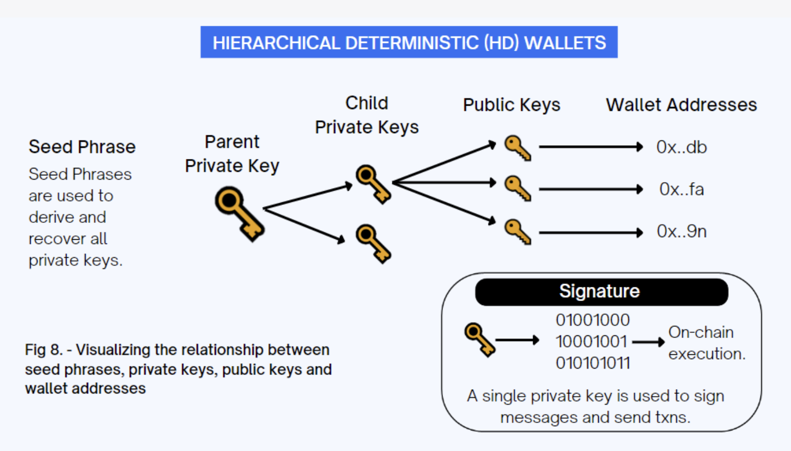

# Apps, Wallets, and Addresses

Okay, we have a ledger, how do we make entries? Let's talk about how users actually can interact with blockchain technology. The interface between humans and blockchain networks comes through applications, wallets, and addresses, each serving distinct but interconnected purposes.

Transactions step-by-step:

1. Key Generation: The wallet generates a matching pair of public and private keys.

1. Transaction Signing: When sending crypto, your wallet uses your private key to sign the transaction.

1. Blockchain Validation: The network validates your transaction using your public key.

1. Funds Received or Sent: The blockchain records the change in ownership.

Your crypto never leaves the blockchain, it simply changes ownership based on key authorization. Like how Santander has a digital record of funds, and is not moving physical dollar bills around from a box labeled "Mylo" to a box labeled "Fazio's Pizzeria". Crypto is merely updating the ledger, the listing of accounts; the funds aren't actually on your phone or in your wallet.  

We will have a hands-on unit in [Module 3](../module-3-practical-usage/) to put this discussion into practice.

## Wallet Apps

**Cryptocurrency applications** are software programs that interact with blockchain networks. These applications provide user-friendly interfaces for complex blockchain operations, making cryptocurrency accessible to non-technical users.

1. My favorite: **Zashi** is a specialized mobile wallet developed by the Electric Coin Company specifically for Zcash (ZEC). Unlike multi-currency wallets, Zashi focuses exclusively on shielded ZEC transactions, making it the premier choice for users who prioritize maximum financial privacy. The app features seamless integration with Coinbase for purchasing ZEC directly within the wallet and partnerships with Flexa for spending ZEC at thousands of retail locations. Zashi emphasizes true self-custody while maintaining a user-friendly interface accessible to cryptocurrency newcomers. The wallet also includes innovative privacy features like decentralized off-ramps for converting shielded ZEC to other cryptocurrencies without compromising transaction privacy. 

1. **MetaMask** is perhaps the most popular cryptocurrency app, serving as both a wallet and a gateway to the Ethereum ecosystem. Think of MetaMask as a "browser for blockchain" that allows users to connect to decentralized applications, manage their cryptocurrency holdings, and interact with smart contracts. MetaMask stores private keys locally on the user's device, providing security while maintaining accessibility.

1. **Edge Wallet** is another popular option for privacy-minded folks, particularly for mobile users. It supports multiple cryptocurrencies and provides features like built-in exchange functionality, allowing users to trade between different cryptocurrencies without leaving the app. Edge Wallet also emphasizes security through features like biometric authentication and encrypted storage.

> **Note** The term "wallet" can be very confusing, vague, and imprecise. Sometimes it refers to the App, sometimes the currency-specific container inside an App, and sometimes the address to that currency-specific container. 

[TODO: Insert some screenshots of wallets and apps, with different wallets, and addresses.]

Other notable apps include:
- **Trust Wallet**: Mobile-first wallet with support for thousands of cryptocurrencies
- **Exodus**: Desktop wallet with built-in exchange and portfolio tracking
- **YWallet**: Multi-address capability with labeling features

Each app has different security features, and different supported cryptocurrencies. 

## Hot vs Cold Wallets

**Digital Wallets (Hot Wallets)** are software-based wallets that are connected to the internet (ex. Edge Wallet). They offer convenience and accessibility but come with increased security risks.

Advantages of Digital Wallets:
- Easy to use and set up
- Quick access to funds for trading
- Integration with DeFi protocols and dApps
- Real-time balance updates
- Backup and recovery options

Disadvantages of Digital Wallets:
- Vulnerable to hacking and malware
- Dependent on device security
- Risk of losing funds if device is compromised
- Limited protection against user error

**Hardware Wallets (Cold Wallets)** are physical devices that store private keys offline, providing the highest level of security for cryptocurrency storage.

Advantages of Hardware Wallets:
- Maximum security through offline storage
- Protection against malware and hacking
- Physical confirmation required for transactions
- Long-term storage solution
- Backup and recovery capabilities

Disadvantages of Hardware Wallets:
- Higher cost (typically $50-200)
- Less convenient for frequent trading
- Risk of physical damage or loss
- Learning curve for setup and use
- Limited integration with DeFi protocols

**Popular Hardware Wallet:**
- **Ledger**: Industry standard with support for thousands of cryptocurrencies

The choice between digital and hardware wallets often depends on use case. Digital wallets are suitable for active traders and DeFi users who need frequent access to their funds. Hardware wallets are better for long-term investors and those holding significant amounts of cryptocurrency.

## Addresses

**Cryptocurrency addresses** are alphanumeric strings that serve as destinations for cryptocurrency transactions. Think of them as email addresses for cryptocurrency. They're public information that others can use to send you cryptocurrency, but they don't reveal your identity or give access to your funds.

**Key Characteristics of Addresses:**
1. **Public Information**: Addresses are meant to be shared publicly
2. **Cryptographically Generated**: Derived from private keys using mathematical functions
3. **Unique**: Each address is mathematically unique
4. **Reusable**: Can receive multiple transactions
5. **Pseudonymous**: Don't directly reveal user identity

**Security Considerations:**
- **Address verification**: Always double-check addresses before sending
- **QR codes**: Many wallets use QR codes to prevent typing errors
- **Address book**: Save frequently used addresses to avoid mistakes
- **Test transactions**: Send small amounts first when using new addresses

> **Note** Like having a burner phone for a single use with call forwarding, some wallets allow you to create new addresses for single-use transactions that link back to a consolidated wallet. 

The relationship between wallets and addresses creates the user experience that makes blockchain technology accessible. **Wallets manage the keys, and addresses enable the transactions.** Together they form the foundation of practical cryptocurrency usage. 

[TODO replace this image with one of my own, tailored for this discussion]

