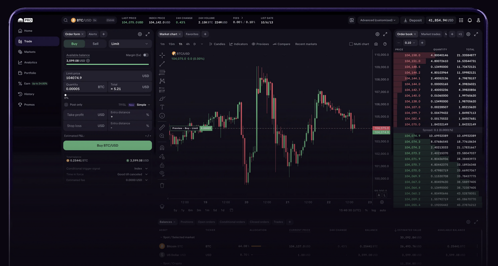

# Baby's First On-Ramping (Buying BTC)

Welcome to your cryptocurrency Christmas morning! Just like a child unwrapping their very first gift, we're about to guide you through the magical process of unwrapping your first Bitcoin. There's something genuinely exciting about holding your own digital money for the first time - watching those cryptographic numbers appear in your wallet, knowing that no bank, government, or institution can take them away from you.

Think of this section as your crypto advent calendar. Each step builds anticipation for the next, from setting up your first exchange account to finally sending your first transaction across the global Bitcoin network. By the time we're done, you'll have gone from crypto-curious to crypto-capable, with real satoshis in your own wallet and the confidence to navigate this brave new financial world.

If Santa or someone special didn't leave your BTC in your stocking on a hardware wallet, you're going to need to buy some to step through this module.

> Choose Your Own Adventure: Kraken or Cashapp

Both require you to verify your identity through a KYC (Know Your Customer) process - show your ID to the bouncer of this exclusive digital crypto club. You'll upload a photo of your driver's license, take a selfie, and sometimes answer a few questions about your financial situation. Then you can buy some Bitcoin. Just like going from USD to EURO, you are going from USD to BTC. It's more like a currency exchange, than a purchase of a new eBook.

- Kraken looks like a Fidelity investment account, it looks familar on the Desktop or Mobile. Kraken is a fully-featured trading platform.

- CashApp might already be on your mobile device, it's good to start buying BTC with little extra setup. 

Option #1: [Kraken](https://www.kraken.com/)

Option #2: [CashApp](https://cash.app/)

Using either of these platforms, buy $200 (or more) of Bitcoin. Just vanilla, nothing special Bitcoin. We'll get to spicier currencies in [Baby's First Currency Swap](#babys-first-currency-swap).

**Recall:** When you buy Bitcoin on these platforms, you don't actually own the Bitcoin yet - the exchange does. It's like having gold stored in someone else's vault with your name on it. The exchange manages all the cryptographic keys (remember those from [Module 2: Keys](../module-2-blockchain/2.1-main-article.md#keys)) on your behalf, which makes things simple but also means you're trusting them with your digital treasure. This is perfectly fine for getting started and small amounts, but as you'll learn in the next section, true Bitcoin ownership means controlling your own keys. 

> CashApp holding the keys for your crypto is similar to when Grandma gave you a $20 bill for your 5th Christmas, it was technically yours, but I bet your parents held on to it for you.
