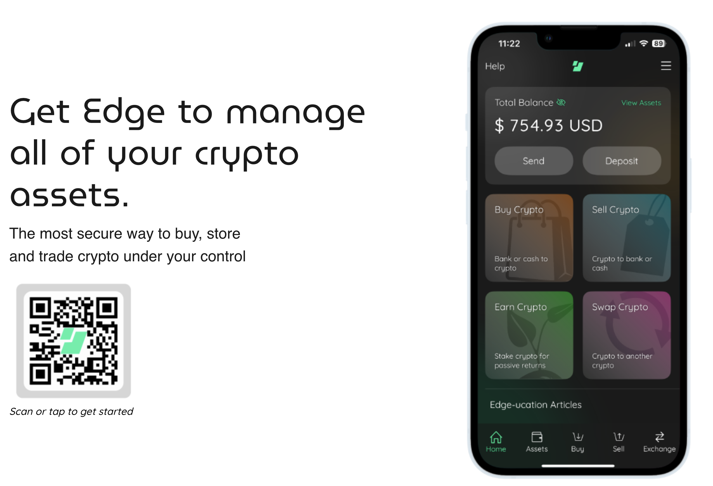

# Baby's First Wallet and Key Management

This Christmas, Grandpa gave you a leather wallet. A real man's wallet, your first wallet that wasn't made of duct tape in 2nd period english class.

Let's get a real self-custody wallet. I recommend downloading Edge Wallet.

[Downloading Edge Wallet](https://edge.app/)
[Setting up the Edge Wallet](https://edge.app/get-started/?af=edge-app-blog)

Why Edge Wallet? It's designed for privacy, it's easy to use, it allows multiple different types of currencies. They also have a wonderful [set-up guide](https://edge.app/get-started/?af=edge-app-blog). 

>**Save those keys!** Save your recovery passphrase into a password manager. DO NOT write it on a slip of paper under your keyboard, the ghost of my grandma will come berate you for irresponsible handling of her $20 christmas gift.

**Check in:** 
- Bank Account -> $200 BTC in Kraken/CashApp
