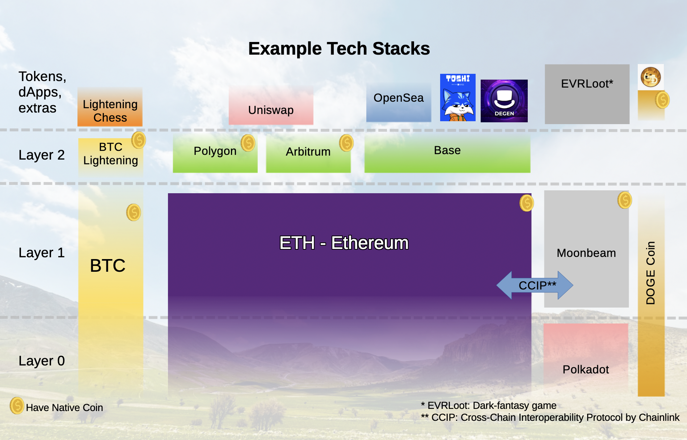

# Layers vs Tokens vs Coins

Let's take a look at the fundamental differences between blockchain layers, tokens, and coins. These terms are often used interchangeably, but they represent distinct concepts in the cryptocurrency ecosystem. 

## **Coins vs Tokens: The Foundation**

**Coins** are the native cryptocurrencies of their own blockchain networks. They serve as the primary means of value transfer and network security for their respective blockchains. Key characteristics of coins include:

- **Native to their blockchain**: Bitcoin (BTC) is the native coin of the Bitcoin blockchain
- **Network security**: Coins are used to pay for transaction fees and incentivize network participants
- **Consensus participation**: Coins are required for staking, mining, or other consensus mechanisms
- **Independent existence**: Coins don't rely on other blockchains for their operation

**Examples of coins:**
- **Bitcoin (BTC)**: Native coin of the Bitcoin blockchain
- **Ethereum (ETH)**: Native coin of the Ethereum blockchain
- **Solana (SOL)**: Native coin of the Solana blockchain
- **NEAR (NEAR)**: Native coin of the NEAR Protocol blockchain (AI focused)
- **Monero (XMR)**: Native privacy coin of the Monero blockchain
- **Zcash (ZEC)**: Native privacy coin of the Zcash blockchain
- **Midnight (MID)**: Native privacy coin of the Midnight blockchain by Shield Labs

**Tokens** are digital assets that exist on top of existing blockchain networks. They leverage the infrastructure and security of their underlying blockchain but serve specific purposes within applications or ecosystems. Key characteristics of tokens include:

- **Built on existing blockchains**: Tokens use the infrastructure of Layer 1 networks
- **Smart contract-based**: Most tokens are created using smart contracts (like ERC-20 on Ethereum)
- **Specific utility**: Tokens often have defined use cases within particular applications
- **Dependent on underlying blockchain**: Tokens inherit the security and consensus of their base layer

**Examples of tokens:**
- **Tether (USDT)**: A stablecoin token that exists on multiple blockchains
- **Uniswap (UNI)**: A governance token for the Uniswap protocol on Ethereum
- **Chainlink (LINK)**: A utility token for the Chainlink oracle network
- **Filecoin (FIL)**: A utility token for decentralized storage services

## **Regulatory Implications**

The classification of digital assets has important regulatory implications:

**Coins:**
- May be treated as commodities or currencies depending on jurisdiction
- Often have clearer regulatory frameworks than tokens
- May face different tax treatment than tokens

**Tokens:**
- May be classified as securities, utilities, or commodities
- Regulatory treatment often depends on the token's use case and structure
- May require different compliance procedures than coins

