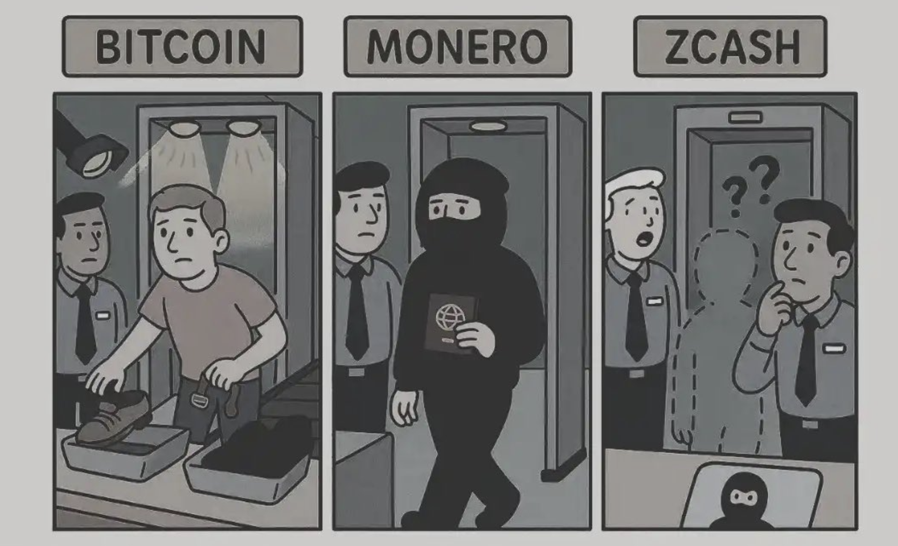

# Privacy Coins: Anonymity in the Digital Age

Privacy coins are cryptocurrencies designed to provide enhanced privacy and anonymity for users. While Bitcoin transactions are pseudonymous (linked to addresses rather than real identities), they are still traceable on the public blockchain. Would you expose your bank statements and the value of all your investment accounts to the world? Or keep that between you and Fidelity. Privacy coins use various cryptographic techniques to obscure transaction details and provide true anonymity: you, and only you, know your account balance. You and only sex worker Chanelita know what you did last weekend, not Uncle Sam nor Chase Bank or Venmo. (We don't judge. 😉)  

- **Monero (XMR)** is perhaps the most well-known privacy coin, using ring signatures and stealth addresses to hide transaction details.
- **Zcash (ZEC)** uses zero-knowledge proofs to make transactions provably and mathematically private. 

These technologies make it extremely difficult (or impossible) to trace transactions or identify users.

> It would be unprofessional of me, to not mention the reputation that Monero has for the go-to currency for drug dealers and black market trading. 

Privacy coins raise important questions about the balance between privacy and regulatory compliance. While privacy is a fundamental human right, privacy coins can also be used for illicit activities, including money laundering and tax evasion.

> Some might even go to far as to say the banning of privacy coins, is a ban on the right to transact privately, a ban on freedom of speech (money is speech), and ultimately an infingement on human rights.

For financial professionals, privacy coins present both opportunities and challenges. On the one hand, they may appeal to clients who value privacy and are concerned about surveillance. On the other hand, they may face regulatory restrictions and reputational risks.

Just as there are times when you want to speak publicly on Twitter, there are also times to speak privately on Signal's encrypted communcations. There are times for public ledgers for auditing of governement spending and non-profits and there are times for personal privacy.
