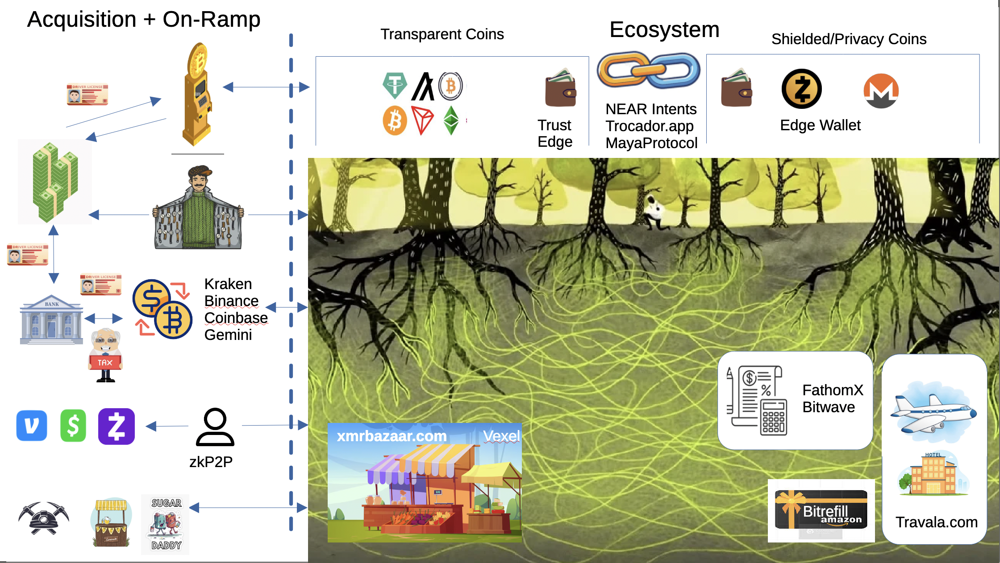

# Supporting Players

The cryptocurrency ecosystem extends far beyond just the digital assets themselves. A complex network of supporting companies and services has emerged to facilitate, regulate, analyze, and support the broader crypto industry. Understanding these supporting players is crucial for financial professionals as they represent both business opportunities and potential risks for clients.

## **Custody and Wallet Services**

**Custodial Services:**
- **[Coinbase Custody](https://custody.coinbase.com)**: Institutional-grade custody for large investors
- **[Fidelity Digital Assets](https://digitalassets.fidelity.com)**: Traditional financial institution entering crypto custody
- **[Anchorage Digital](https://anchorage.com)**: Specialized in institutional custody solutions
- **[BitGo](https://bitgo.com)**: Multi-signature wallet and custody services

**Non-Custodial Solutions:**
- **[MetaMask](https://metamask.io)**: Popular browser-based wallet for Ethereum
- **[Ledger](https://ledger.com)**: Hardware wallet manufacturer for cold storage
- **[Trezor](https://trezor.io)**: Another major hardware wallet provider
- **[Trust Wallet](https://trustwallet.com)**: Mobile wallet owned by Binance

## **Data and Analytics Providers**

**Market Data:**
- **[CoinGecko](https://coingecko.com)**: Comprehensive cryptocurrency data and rankings
- **[CoinMarketCap](https://coinmarketcap.com)**: Market cap and price data aggregator
- **[Messari](https://messari.io)**: Research and analytics platform for crypto assets
- **[Glassnode](https://glassnode.com)**: On-chain analytics and market intelligence

**Blockchain Analytics:**
- **[Chainalysis](https://chainalysis.com)**: Blockchain analysis for compliance and investigation
- **[Elliptic](https://elliptic.co)**: Risk management and compliance for crypto businesses
- **[CipherTrace](https://ciphertrace.com)**: Blockchain intelligence and anti-money laundering
- **[TRM Labs](https://trmlabs.com)**: Digital asset compliance and risk management

## **Tax Services**
**Tax Software:**
- **[CoinTracker](https://cointracker.io)**: Cryptocurrency tax calculation and reporting
- **[TaxBit](https://taxbit.com)**: Automated crypto tax compliance
- **[CryptoTrader.Tax](https://cryptotrader.tax)**: Tax loss harvesting and reporting
- **[ZenLedger](https://zenledger.io)**: Tax software for crypto investor

## **Insurance and Risk Management**

**Crypto Insurance:**
- **[Coincover](https://coincover.com)**: Cryptocurrency insurance and recovery services
- **[Evertas](https://evertas.com)**: Insurance for crypto assets and mining operations
- **[Breach Insurance](https://breachinsurance.com)**: Cyber insurance for crypto companies
- **[Lloyd's of London](https://lloyds.com)**: Traditional insurer entering crypto space

## **Media and Information**

**News and Media:**
- **[CoinDesk](https://coindesk.com)**: Leading crypto news and information platform
- **[Decrypt](https://decrypt.co)**: Crypto news and educational content
- **[Cointelegraph](https://cointelegraph.com)**: International crypto news platform
- **[The Rollup](https://therollup.co)**: Crypto news and analysis platform

**Research and Analysis:**
- **[Messari](https://messari.io)**: Crypto research and analytics
- **[Delphi Digital](https://delphidigital.io)**: Institutional-grade crypto research
- **[The Block Research](https://theblock.co/research)**: Market analysis and insights
- **[Glassnode](https://glassnode.com)**: On-chain analytics and market intelligence

The supporting players ecosystem continues to evolve rapidly, with traditional financial services companies increasingly entering the space and new specialized services emerging to meet the unique needs of the cryptocurrency industry. Financial professionals who understand this ecosystem can better serve their clients and identify opportunities in this growing sector.
